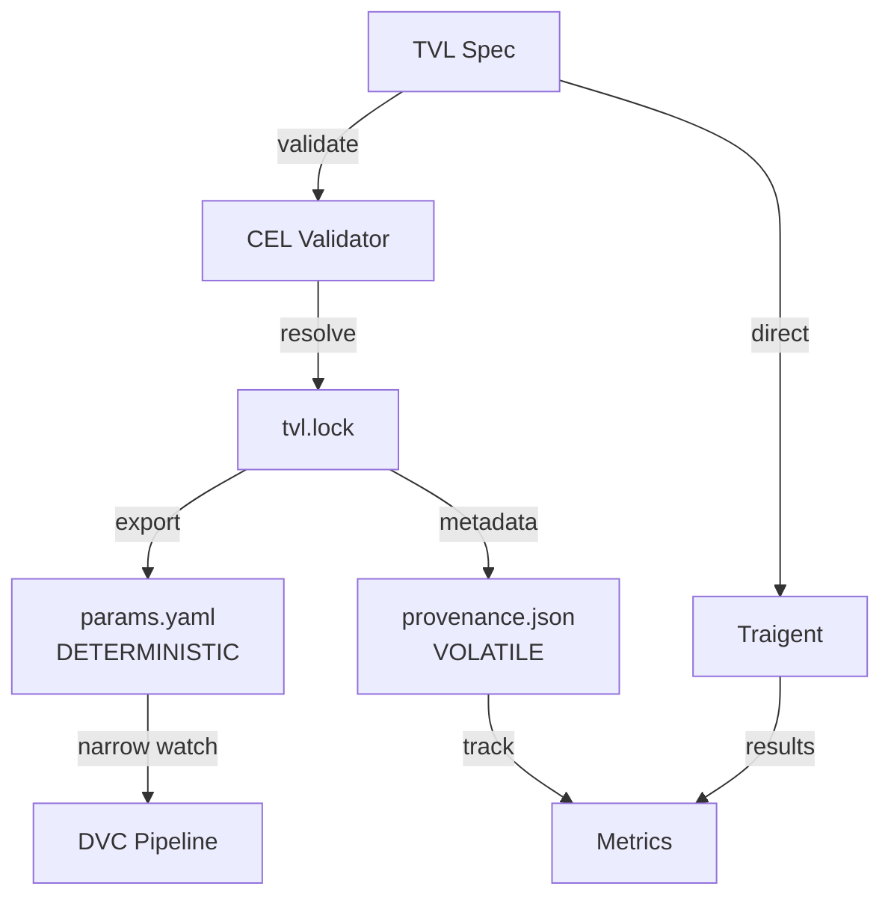

# TVL Unification Design v2.0: Production-Ready Configuration Management

**Version**: 2.0.0
**Date**: October 14, 2024
**Status**: REFINED (Post-Review)
**Authors**: Architecture Team
**Reviewers**: ChatGPT Pro, Claude Opus

---

## Executive Summary

This document presents the **refined TVL (Type-safe Validation Language) unification architecture** for Traigent, incorporating critical P0 refinements from architectural review. TVL becomes the single source of truth for configuration, with `params.yaml` as deterministic generated output and DVC as the orchestration layer.

**Key Refinements in v2.0**:
- ✅ **Deterministic export** - No volatile fields in params.yaml
- ✅ **CEL constraint grammar** - Formal expression language, no free-form strings
- ✅ **Strict override semantics** - Type-safe environment overlays
- ✅ **Unit typing system** - Explicit units for all measurements
- ✅ **Separated provenance** - Volatile metadata in separate file

---

## 1. Architecture Overview

### 1.1 Core Principle

**TVL defines → Traigent executes → DVC orchestrates → params.yaml bridges (deterministically)**

### 1.2 Component Roles (Refined)

| Component | Role | Characteristics |
|-----------|------|----------------|
| **TVL Spec** | Single source of truth for configuration | Versioned, validated, type-safe |
| **params.yaml** | Generated DVC bridge (deterministic) | No timestamps, no volatile data |
| **provenance.json** | Volatile metadata tracker | Timestamps, versions, runtime info |
| **tvl.lock** | Resolved inheritance graph | Deterministic dependency resolution |
| **Traigent** | Optimization executor | Reads TVL directly for full semantics |
| **DVC** | Pipeline orchestrator | Watches narrow params subsets |

### 1.3 Data Flow (Updated)



---

## 2. P0 Refinements (Critical Blockers Resolved)

### 2.1 Deterministic Export Contract

#### Problem Solved
Volatile fields in params.yaml cause unnecessary git diffs and spurious DVC reruns.

#### Solution: Strict Separation

**params.yaml (Deterministic):**
```yaml
# AUTO-GENERATED from tvl/spec/experiment.tvl.yml
# DO NOT EDIT - Deterministic output only
# No timestamps, no versions, no volatile data

tvl:
  spec_path: tvl/spec/experiments/multi-objective-llm.tvl.yml
  spec_sha: abc123def456789  # Git SHA of spec file content

data:
  split_ratio: 0.2
  seed: 42

optimize:
  algorithm: nsga2
  max_trials: 100
  parallel_config:
    trial_concurrency: 4
  timeout_seconds: 3600  # Explicit unit in key name

evaluate:
  baseline_path: results/baseline.json
  threshold_value: 0.02
  metrics: [accuracy, cost, latency]
```

**provenance.json (Volatile):**
```json
{
  "generation": {
    "exported_at": "2024-10-14T10:30:00.123Z",
    "export_duration_ms": 42,
    "hostname": "ci-runner-7",
    "user": "github-actions"
  },
  "versions": {
    "traigent": "1.0.0",
    "traigent_tvl": "0.1.0",
    "dvc": "3.0.0",
    "python": "3.11.5"
  },
  "environment": {
    "name": "staging",
    "overrides_applied": ["staging"],
    "override_diff": {
      "optimize.max_trials": {"base": 100, "override": 50}
    }
  },
  "inheritance": {
    "resolution_order": [
      "tvl/spec/base/llm-base.tvl.yml",
      "tvl/spec/experiments/multi-objective-llm.tvl.yml"
    ],
    "merged_sha": "def456ghi789"
  }
}
```

#### Export Rules

1. **Deterministic fields only** in params.yaml
2. **No timestamps** ever in params.yaml
3. **No version numbers** in params.yaml (except spec SHA)
4. **Explicit units** in key names (e.g., `timeout_seconds` not `timeout`)
5. **Sorted keys** for consistent output
6. **Normalized values** (e.g., floats always have decimal point)

---

### 2.2 CEL Constraint Grammar

#### Problem Solved
Free-form string constraints are ambiguous, unsafe, and hard to validate.

#### Solution: Common Expression Language (CEL)

**Before (Unsafe):**
```yaml
constraints:
  - type: conditional
    condition: "model == 'gpt-4o-mini'"  # Free-form string
    constraint: "temperature <= 0.7"      # Ambiguous parsing
```

**After (CEL):**
```yaml
constraints:
  - id: "mini-model-temperature"
    type: conditional
    when: 'params.model == "gpt-4o-mini"'  # CEL expression
    then: 'params.temperature <= 0.7'
    error_message: "Mini models require temperature <= 0.7"

  - id: "token-cost-limit"
    type: expression
    rule: 'params.temperature * params.max_tokens < 3000'
    error_message: "Token-temperature product exceeds limit"

  - id: "premium-model-cache"
    type: forbidden
    rule: 'params.model in ["gpt-4o", "claude-3-opus"] && !params.use_cache'
    error_message: "Premium models require caching"
```

#### CEL Grammar Specification

**Supported Types:**
- Primitives: `bool`, `int`, `double`, `string`
- Collections: `list`, `map`
- Special: `duration`, `timestamp`

**Operators:**
```
Arithmetic: +, -, *, /, %
Comparison: ==, !=, <, <=, >, >=
Logical: &&, ||, !
Membership: in
Ternary: condition ? true_value : false_value
```

**Built-in Functions:**
```cel
// String functions
params.model.startsWith("gpt")
params.model.matches("claude-[0-9]")

// Numeric functions
math.ceil(params.temperature)
math.abs(params.cost - params.budget)

// List functions
params.metrics.size() >= 2
params.models.exists(m, m.startsWith("claude"))

// Type checking
type(params.temperature) == double
has(params.optional_field)
```

**Validation Process:**
```python
import cel

def validate_constraint(expr: str, params: dict) -> tuple[bool, str]:
    """Validate CEL constraint against parameters"""
    env = cel.Environment()

    # Register parameter types
    for key, value in params.items():
        env.add_variable(f"params.{key}", type(value))

    # Compile and evaluate
    try:
        ast = env.compile(expr)
        program = env.program(ast)
        result = program.evaluate({"params": params})
        return (result, None) if isinstance(result, bool) else (False, "Non-boolean result")
    except cel.EvalError as e:
        return (False, str(e))
```

---

### 2.3 Unit Typing System

#### Problem Solved
Ambiguous units lead to errors (ms vs s, USD vs EUR).

#### Solution: Explicit Unit Objects

**Before (Ambiguous):**
```yaml
latency:
  threshold: 2000  # ms? seconds?
budget: 50.0      # USD? EUR?
```

**After (Explicit):**
```yaml
latency:
  threshold:
    value: 2000
    unit: milliseconds

budget:
  max_cost:
    value: 50.0
    currency: USD

temperature:
  range:
    min: 0.0
    max: 1.0
    unit: ratio  # Dimensionless [0,1]

timeout:
  duration:
    value: 60
    unit: seconds
```

**Canonical Units:**
```yaml
units:
  time: [nanoseconds, microseconds, milliseconds, seconds, minutes, hours]
  currency: [USD, EUR, GBP, JPY, CNY]
  memory: [bytes, KB, MB, GB, TB]
  ratio: dimensionless  # For [0,1] parameters
  count: dimensionless  # For integer counts
  percentage: percent   # For 0-100 values
```

---

### 2.4 Strict Override Semantics

#### Problem Solved
Uncontrolled overrides can violate type safety and constraints.

#### Solution: Type-Preserving Overlays

**Override Rules:**

1. **Type Preservation**: Cannot change parameter type
2. **Domain Narrowing**: Can only restrict, not expand
3. **Constraint Respect**: Must satisfy all base constraints
4. **No Deletion**: Cannot remove required fields

**Examples:**

```yaml
# base.tvl.yml
configuration_space:
  temperature:
    type: continuous
    range: [0.0, 1.0]

  model:
    type: categorical
    values: ["gpt-4o-mini", "gpt-4o", "claude-3-haiku", "claude-3-sonnet"]

# production.tvl.yml (Valid Override)
extends: base.tvl.yml
environments:
  production:
    configuration_space:
      temperature:
        range: [0.3, 0.7]  # ✅ Narrowed range

      model:
        values: ["gpt-4o", "claude-3-sonnet"]  # ✅ Subset of options

# invalid-override.tvl.yml (Would Fail Validation)
environments:
  bad:
    configuration_space:
      temperature:
        type: categorical  # ❌ Type change forbidden
        values: [0.3, 0.5, 0.7]

      model:
        values: ["gpt-4o", "new-model"]  # ❌ Cannot add new options
```

**Override Precedence Chain:**
```
base spec → extends chain → environment overlay → CLI overrides
```

**Validation Algorithm:**
```python
def validate_override(base: dict, override: dict) -> tuple[bool, list[str]]:
    """Validate that override preserves types and narrows domains"""
    errors = []

    for key, override_value in override.items():
        base_value = base.get(key)

        # Check type preservation
        if base_value and type(base_value) != type(override_value):
            errors.append(f"{key}: type change forbidden")

        # Check domain narrowing for continuous
        if base_value.get("type") == "continuous":
            base_range = base_value["range"]
            override_range = override_value.get("range", base_range)
            if (override_range[0] < base_range[0] or
                override_range[1] > base_range[1]):
                errors.append(f"{key}: range expansion forbidden")

        # Check subset for categorical
        if base_value.get("type") == "categorical":
            base_values = set(base_value["values"])
            override_values = set(override_value.get("values", []))
            if not override_values.issubset(base_values):
                errors.append(f"{key}: new categorical values forbidden")

    return (len(errors) == 0, errors)
```

---

## 3. P1 Improvements

### 3.1 Objective Semantics Clarification

**Clear Strategy Definitions:**

```yaml
objectives:
  - name: accuracy
    direction: maximize

  - name: cost
    direction: minimize

  - name: latency
    direction: minimize

optimization:
  strategy: pareto_optimal  # Explicit strategy

  # Strategy-specific configuration
  pareto_config:
    selection_method: crowding_distance  # How to select from Pareto front

  # Weights used ONLY for:
  # - Tie-breaking in Pareto selection
  # - Display/ranking purposes
  # NOT for scalarization
  display_weights:
    accuracy: 0.6
    cost: 0.3
    latency: 0.1
```

**Alternative: Weighted Sum Strategy**
```yaml
optimization:
  strategy: weighted_sum  # Explicit scalarization

  # Weights used for actual scalarization
  scalarization_weights:
    accuracy: 0.6
    cost: 0.3
    latency: 0.1
```

### 3.2 Budget & Stopping Rules

**Clear Precedence:**

```yaml
execution:
  optimizer:
    stopping_condition: any_limit_reached  # or all_limits_reached

    limits:
      max_trials: 100
      max_duration:
        value: 3600
        unit: seconds
      max_cost:
        value: 50.0
        currency: USD

    behavior:
      graceful_completion: true  # Complete in-flight trials
      save_on_interrupt: true    # Save state on early stop
```

### 3.3 Security: No Secrets in TVL

**Secret References Only:**

```yaml
# NEVER put actual secrets in TVL
api_keys:
  openai: ${secret:OPENAI_API_KEY}      # Environment variable
  anthropic: ${vault:secret/anthropic}   # HashiCorp Vault
  aws: ${aws:secretsmanager:api-keys}   # AWS Secrets Manager

# Resolution at runtime only
runtime:
  secret_resolver: environment  # or vault, aws, azure
```

---

## 4. Implementation Checklist

### 4.1 P0 Requirements (Must Have)

- [ ] **Deterministic Exporter**
  - [ ] No timestamps in params.yaml
  - [ ] Sorted keys
  - [ ] Normalized values
  - [ ] Unit tests for determinism

- [ ] **CEL Integration**
  - [ ] CEL parser and evaluator
  - [ ] Constraint validator
  - [ ] Error messages for violations
  - [ ] Security sandboxing

- [ ] **Override Validator**
  - [ ] Type preservation checks
  - [ ] Domain narrowing validation
  - [ ] Constraint satisfaction
  - [ ] Override diff generator

### 4.2 P1 Requirements (Should Have)

- [ ] **Objective Clarification**
  - [ ] Explicit strategy field
  - [ ] Strategy-specific configs
  - [ ] Weight semantics documentation

- [ ] **Stopping Rules**
  - [ ] Clear precedence rules
  - [ ] Graceful completion option
  - [ ] State saving on interrupt

- [ ] **Security**
  - [ ] Secret reference parser
  - [ ] Runtime secret resolution
  - [ ] Secret scanning in CI

### 4.3 CI/CD Requirements

- [ ] **Validation Pipeline**
  ```yaml
  - validate_tvl_schema
  - validate_cel_constraints
  - validate_overrides
  - check_determinism
  - scan_for_secrets
  ```

- [ ] **Determinism Check**
  ```bash
  # Generate twice and compare
  traigent-tvl export spec.tvl.yml > params1.yaml
  traigent-tvl export spec.tvl.yml > params2.yaml
  diff params1.yaml params2.yaml || exit 1
  ```

- [ ] **No Manual Edit Check**
  ```bash
  # Regenerate and compare with committed
  traigent-tvl export $TVL_SPEC > params.generated.yaml
  diff params.yaml params.generated.yaml || {
    echo "ERROR: params.yaml was manually edited"
    exit 1
  }
  ```

---

## 5. DVC Integration (Refined)

### 5.1 Narrow Parameter Watching

**dvc.yaml (Optimized):**
```yaml
stages:
  validate_tvl:
    cmd: traigent-tvl validate --spec ${TVL_SPEC}
    deps:
      - ${TVL_SPEC}
    outs:
      - tvl/validated/${TVL_SPEC_NAME}.ok
      - tvl/lock/${TVL_SPEC_NAME}.lock

  export_params:
    cmd: |
      traigent-tvl export --spec ${TVL_SPEC} --env ${ENV} > params.yaml
      traigent-tvl provenance --spec ${TVL_SPEC} --env ${ENV} > results/provenance.json
    deps:
      - ${TVL_SPEC}
      - tvl/lock/${TVL_SPEC_NAME}.lock
    outs:
      - params.yaml
    metrics:
      - results/provenance.json:
          cache: false

  optimize:
    cmd: traigent optimize --tvl-spec ${TVL_SPEC}
    deps:
      - params.yaml
    params:
      # NARROW watching - only what this stage uses
      - optimize.algorithm
      - optimize.max_trials
      - optimize.parallel_config.trial_concurrency
    metrics:
      - results/metrics.json

  evaluate:
    cmd: python evaluate.py
    deps:
      - results/metrics.json
    params:
      # NARROW watching - only evaluation params
      - evaluate.baseline_path
      - evaluate.threshold_value
    metrics:
      - results/evaluation.json
```

---

## 6. Migration Path (Updated)

### 6.1 Phase 1: Tool Development (Week 1)

```python
# traigent-tvl package structure
traigent_tvl/
├── core/
│   ├── spec.py          # TVL data model
│   ├── validator.py     # Schema + CEL validation
│   └── resolver.py      # Inheritance resolution
├── export/
│   ├── deterministic.py # Deterministic params.yaml
│   ├── provenance.py    # Volatile metadata
│   └── lock.py          # Dependency lock file
├── constraints/
│   ├── cel.py           # CEL engine wrapper
│   └── overrides.py     # Override validator
└── cli.py               # CLI commands
```

### 6.2 Phase 2: Integration (Week 2)

- Integrate with Traigent optimizer
- Add DVC pipeline stages
- Create migration scripts

### 6.3 Phase 3: Validation (Week 3)

- Golden test suite
- Performance benchmarks
- Security audit

---

## 7. Example: Complete TVL v2.0 Spec

```yaml
version: "2.0"
kind: optimization

metadata:
  name: production-llm-optimization
  description: Multi-objective LLM optimization with strict constraints

configuration_space:
  model:
    type: categorical
    values: ["gpt-4o-mini", "claude-3-haiku", "claude-3-sonnet"]

  temperature:
    type: continuous
    range: [0.0, 1.0]
    unit: ratio

  max_tokens:
    type: discrete
    values: [100, 500, 1000, 2000]
    unit: count

constraints:
  - id: mini-model-temp
    type: conditional
    when: 'params.model == "gpt-4o-mini"'
    then: 'params.temperature <= 0.7'
    error_message: "Mini model requires low temperature"

objectives:
  - name: accuracy
    direction: maximize
    evaluator: semantic_similarity

  - name: cost
    direction: minimize
    evaluator: token_cost
    budget:
      value: 10.0
      currency: USD

optimization:
  strategy: pareto_optimal
  pareto_config:
    selection_method: crowding_distance

execution:
  stopping_condition: any_limit_reached
  limits:
    max_trials: 100
    max_duration:
      value: 3600
      unit: seconds
    max_cost:
      value: 50.0
      currency: USD

environments:
  production:
    configuration_space:
      temperature:
        range: [0.3, 0.7]  # Narrowed for production
      model:
        values: ["claude-3-sonnet"]  # Single model in prod
```

---

## 8. Success Criteria

### Must Have (P0)
- ✅ params.yaml is 100% deterministic
- ✅ All constraints use CEL expressions
- ✅ Override validation prevents type violations
- ✅ CI blocks manual params.yaml edits
- ✅ Provenance tracked separately

### Should Have (P1)
- ✅ Clear objective semantics
- ✅ Explicit stopping rules
- ✅ No secrets in TVL specs
- ✅ Unit typing throughout
- ✅ Minimal unsatisfiable core detection

### Nice to Have (P2)
- ✅ Visual TVL editor
- ✅ Automatic migration tool
- ✅ Performance profiling
- ✅ A/B testing framework

---

## 9. Conclusion

TVL Unification v2.0 addresses all critical review feedback while maintaining the vision of a single source of truth for Traigent configuration. The deterministic export, CEL constraints, and strict override semantics ensure production readiness.

**Next Steps:**
1. Review and approve this v2.0 design
2. Implement traigent-tvl package
3. Create reference implementations
4. Begin phased migration

---

## Appendix A: CEL Quick Reference

```cel
// Parameter access
params.model
params.temperature

// Comparisons
params.temperature > 0.5
params.model == "gpt-4o"

// Lists
params.model in ["gpt-4o", "claude-3"]
params.metrics.size() >= 2

// Conditionals
params.use_cache ? params.cache_size : 0

// String operations
params.model.startsWith("gpt")
params.model.matches(".*-mini$")

// Math
math.ceil(params.cost)
math.min(params.a, params.b)

// Type checking
type(params.temperature) == double
has(params.optional_field)
```

---

## Appendix B: Unit Conversion Table

| Domain | Base Unit | Conversions |
|--------|-----------|-------------|
| Time | seconds | 1s = 1000ms, 1m = 60s, 1h = 3600s |
| Memory | bytes | 1KB = 1024B, 1MB = 1024KB, 1GB = 1024MB |
| Currency | USD | Use real-time exchange rates |
| Ratio | dimensionless | [0.0, 1.0] range |
| Percentage | percent | [0, 100] range |

---

**END OF DOCUMENT**

*Version*: 2.0.0
*Status*: REFINED
*Last Updated*: October 14, 2024
