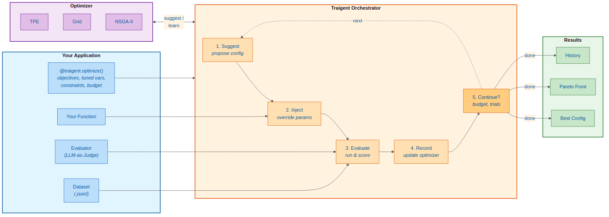

# Traigent

**If you can evaluate it, optimize it. Specify evaluation set and eval, and start optimizing today.**

[](https://github.com/Traigent/Traigent/actions)
[](https://www.python.org/downloads/)
[](LICENSE)

Traigent adds zero-code-change optimization to existing agents, RAG pipelines, and sequential chains so you can improve accuracy and reduce cost without refactoring or extra dev time. Works with LangChain, LlamaIndex, and direct API calls (OpenAI, Anthropic, etc.).

---

## How It Works



1. **Decorate** your function with `@traigent.optimize()` - define objectives, tuned variables, and constraints
2. **Provide** an evaluation dataset and optional custom evaluator (LLM-as-Judge)
3. **Run** optimization - Traigent suggests configs, injects parameters, evaluates, and learns
4. **Get** the best configuration, Pareto front, and full history

Traigent optimizes existing functions in place. For router agents, it tunes the handoff to the right specialist and the configs used by each step.

| Architecture           | Support     | Notes                                          |
| ---------------------- | ----------- | ---------------------------------------------- |
| Single Agent           | Full        | Any LLM-powered function                       |
| RAG                    | Full        | Optimize retriever depth, chunking, and models |
| Router Agents          | Full        | 1-to-1 handoff to a specialized agent          |
| Sequential Chains      | Full        | Multi-step agent pipelines                     |
| Multi-Agent (parallel) | Coming Soon | Multiple tunables simultaneously               |

---

## Golden Path: Router Agent + LiteLLM

Decorate your existing router, pass an evaluation set, and Traigent will tune across OpenAI, Anthropic, and Google models via LiteLLM.

```python
import asyncio
import traigent
from litellm import completion

EVAL_DATASET = "eval/support_tickets.jsonl"  # Required

PROVIDER_MODELS = [
    "gpt-4o-mini",             # OpenAI
    "claude-3-haiku-20240307", # Anthropic
    "gemini/gemini-pro",       # Google
]

def llm_judge(output: str, expected: str, **kwargs) -> float:
    """LLM-as-a-judge accuracy scorer (0.0-1.0)."""
    judge = completion(
        model="gpt-4o-mini",
        messages=[{
            "role": "user",
            "content": f"Score 0-1. Expected: {expected}\nActual: {output}\nScore:",
        }],
    )
    return float(str(judge.choices[0].message.content).strip())

@traigent.optimize(
    configuration_space={
        "router_model": PROVIDER_MODELS,
        "agent_model": PROVIDER_MODELS,
        "temperature": [0.1, 0.4],
    },
    eval_dataset=EVAL_DATASET,
    objectives=["accuracy", "cost"],  # Maximize accuracy, minimize cost
    scoring_function=llm_judge,       # Custom accuracy metric
    cost_limit=0.01,                  # Optional safety budget (USD)
)
def support_router(ticket: str) -> str:
    config = traigent.get_config()
    route = str(completion(
        model=config["router_model"],
        messages=[{"role": "user", "content": f"Route: {ticket}\nAnswer: billing|tech"}],
    ).choices[0].message.content).lower()

    system = "You are a billing specialist." if "billing" in route else "You are a tech specialist."
    response = completion(
        model=config["agent_model"],
        temperature=config["temperature"],
        messages=[{"role": "system", "content": system}, {"role": "user", "content": ticket}],
    )
    return str(response.choices[0].message.content)

async def main():
    results = await support_router.optimize(algorithm="bayesian", max_trials=20)
    print(results.best_config, results.best_score)

asyncio.run(main())
```

**Evaluation datasets** are JSONL with input/output fields:

```jsonl
{"input": {"ticket": "Refund request for order #123"}, "output": "billing"}
```

Traigent tracks cost and latency automatically; accuracy comes from your evaluator or dataset.
Install LiteLLM with `pip install litellm` and set provider API keys (`OPENAI_API_KEY`, `ANTHROPIC_API_KEY`, etc.).

See the [Evaluation Guide](docs/guides/evaluation.md) and [Complete Function Specification](docs/api-reference/complete-function-specification.md) for metrics and optimization parameters.

---

## Cost Warning

Traigent runs multiple trials = multiple API calls = costs add up.

| Safety Setting           | Command                              |
| ------------------------ | ------------------------------------ |
| Mock Mode (no API calls) | `export TRAIGENT_MOCK_LLM=true`      |
| Cost Limit               | `export TRAIGENT_RUN_COST_LIMIT=2.0` |

See [DISCLAIMER.md](DISCLAIMER.md) for details.

---

## Installation

### Add to Your Existing Project (Recommended)

```bash
# From your project virtualenv
pip install -e "/path/to/Traigent[integrations]"

# Or with uv (faster)
uv pip install -e "/path/to/Traigent[integrations]"
```

```python
# Then in your code:
import traigent

@traigent.optimize(...)
def your_agent(...):
    ...  # Your unchanged code
```

Requirements: Python 3.11-3.13 on Linux, macOS, or Windows.

### Feature Sets

| Feature Set      | Description                   | Use Case                         |
| ---------------- | ----------------------------- | -------------------------------- |
| `[core]`         | Basic functionality (default) | Minimal install                  |
| `[analytics]`    | Analytics and visualization   | View optimization results        |
| `[bayesian]`     | Bayesian optimization         | Advanced optimization algorithms |
| `[integrations]` | Framework integrations        | LangChain, OpenAI, Anthropic     |
| `[playground]`   | Interactive UI                | Streamlit control center         |
| `[examples]`     | Example dependencies          | Run all demo scripts             |
| `[dev]`          | Development tools             | pytest, black, ruff, mypy        |
| `[all]`          | Complete installation         | Everything above                 |

### Run Bundled Examples / Dev Setup

```bash
git clone https://github.com/Traigent/Traigent.git
cd Traigent
python -m venv .venv && source .venv/bin/activate
pip install -e ".[dev,integrations]"

# Test without API keys
export TRAIGENT_MOCK_LLM=true
python examples/quickstart/01_simple_qa.py
```

---

## Quick Reference

```python
@traigent.optimize(
    configuration_space={"model": [...], "temperature": [...]},
    eval_dataset="path/to/data.jsonl",
    objectives=["accuracy", "cost"],
    scoring_function=my_evaluator,  # Optional custom accuracy metric
    execution_mode="edge_analytics",
    cost_limit=2.0,
)
def my_agent(query: str) -> str:
    config = traigent.get_config()
    # Use config["model"], config["temperature"], etc.
    ...
```

```python
results = await agent.optimize(algorithm="bayesian", max_trials=50)
agent.apply_best_config(results)
answer = agent("Your query here")
```

```bash
traigent optimize module.py -a bayesian -n 20
traigent validate path/to/data.jsonl -o accuracy -o cost
traigent results list
```

---

## Traigent Cloud

The SDK runs locally. A Traigent Cloud API key unlocks advanced capabilities:

- **AI Planner**: Natural language to agent, benchmark, and measure generation
- **Advanced Insights**: Trade-off analysis, correlations, trend analysis, Pareto frontier
- **Cost Tracking**: Per-request cost calculation, budget-aware metrics
- **Security and Audit**: API key lifecycle, audit logs, compliance reports
- **Analytics Dashboard**: System health monitoring, performance trends

Run locally today with `execution_mode="edge_analytics"`.
Get a Cloud API key at <https://traigent.ai/>.

---

## Execution Modes

| Mode                         | Status      | Privacy          | Algorithm            | Best For            |
| ---------------------------- | ----------- | ---------------- | -------------------- | ------------------- |
| **Local** (`edge_analytics`) | Available   | Complete         | Random/Grid/Bayesian | All use cases       |
| **Cloud**                    | Coming Soon | Metadata         | Bayesian             | Production, teams   |
| **Hybrid**                   | Coming Soon | Execution local  | Bayesian             | Balanced approach   |

---

## Injection Modes

Traigent supports two ways to inject optimized parameters:

**Seamless Mode (Default)** - Zero code changes:

```python
@traigent.optimize(
    configuration_space={"model": ["gpt-4o-mini", "gpt-4o"], "temperature": [0.1, 0.9]}
)
def my_agent(query: str) -> str:
    llm = ChatOpenAI(model="gpt-4o-mini", temperature=0.7)  # Auto-optimized!
    return llm.invoke(query).content
```

**Parameter Mode** - Explicit control:

```python
@traigent.optimize(
    injection_mode="parameter",
    configuration_space={"model": ["gpt-4o-mini"], "k": [3, 5, 10]}
)
def my_agent(query: str) -> str:
    config = traigent.get_config()
    llm = ChatOpenAI(model=config["model"])  # Explicit access
    return llm.invoke(query).content
```

| Mode          | Best For                                          |
| ------------- | ------------------------------------------------- |
| **Seamless**  | Existing codebases, rapid adoption, zero migration |
| **Parameter** | New development, type safety, complex logic        |

---

## Capability Matrix

| Feature            | What It Does                             | Why It Matters                              |
| ------------------ | ---------------------------------------- | ------------------------------------------- |
| Seamless Injection | Override params without code changes     | Zero migration effort                       |
| Budget Rails       | Real-time cost enforcement with approval | Never exceed $2 by accident                 |
| Multi-Agent Tuning | Tune entire pipelines together           | 1 run vs N sequential runs                  |
| TVL Specs          | Declarative optimization intent          | Version control your optimization strategy  |
| RAGAS Integration  | RAG-specific metrics built-in            | Faithfulness, relevance, precision          |
| Parallel Batching  | Cost-aware concurrent execution          | Smart budget distribution                   |

---

## Unique Capabilities

| Capability                        | Description                                                                    |
| --------------------------------- | ------------------------------------------------------------------------------ |
| **Dual Injection Modes**          | Seamless (zero-code via RuntimeShim) or Parameter (explicit `config.get()`)    |
| **3-Tier Evaluation**             | Exact match (default) -> Custom scorers -> LLM-as-Judge/RAGAS                  |
| **Budget Rails**                  | `TRAIGENT_RUN_COST_LIMIT` + handshake approval + EMA estimation                |
| **2-Level Parallelism**           | `example_concurrency` (per trial) + `trial_concurrency` (simultaneous configs) |
| **Multi-Objective Aggregation**   | WEIGHTED_SUM, HARMONIC, CHEBYSHEV + BANDED objectives with TOST testing        |
| **TVL (Traigent Validation Language)** | YAML specs for objectives, constraints, budgets - optimizer-agnostic      |
| **Constraint DSL**                | Functional, operator, or fluent syntax for config constraints                  |
| **Smart Pruning**                 | Median/Percentile/Threshold/Timeout pruners + adaptive early stopping          |
| **Sample Budget Leasing**         | `max_total_examples` caps evaluations = 60-80% cost reduction                  |
| **100+ LLM Providers**            | Via LiteLLM - optimize across providers in a single run                        |

---

## LLM-as-Judge Evaluation

For subjective outputs where multiple valid answers exist:

```python
def llm_judge_accuracy(output: str, expected: str) -> float:
    """Use an LLM to score correctness. Returns 0.0-1.0."""
    from openai import OpenAI
    client = OpenAI()

    response = client.chat.completions.create(
        model="gpt-4o-mini",
        messages=[{"role": "user", "content": f"""Score correctness (0.0-1.0):
Expected: {expected}
Actual: {output}
Reply with ONLY a number."""}],
        temperature=0.0,
    )
    return float(response.choices[0].message.content.strip())

@traigent.optimize(
    configuration_space={"model": ["gpt-4o-mini", "gpt-4o"]},
    objectives=["accuracy", "cost"],
    scoring_function=llm_judge_accuracy,
    eval_dataset="data/qa_samples.jsonl",
)
def my_agent(question: str) -> str:
    ...
```

---

## Config Persistence

```python
# 1. Run optimization
results = await my_agent.optimize()

# 2. Export for version control
my_agent.export_config("configs/prod.json")

# 3. Load in production
@traigent.optimize(
    load_from="configs/prod.json",
    configuration_space={"model": ["gpt-3.5-turbo", "gpt-4"]},
)
def my_agent(query: str) -> str:
    ...
```

---

## Resources

| Resource                                          | Description                        |
| ------------------------------------------------- | ---------------------------------- |
| [SDK Documentation](docs/README.md)               | Full API reference and guides      |
| [Examples](examples/)                             | Working code examples              |
| [Walkthrough](walkthrough/README.md)              | Simple end-to-end tutorial         |
| [Playground](playground/)                         | Interactive Streamlit UI           |
| [Evaluation Guide](docs/guides/evaluation.md)     | Dataset formats and custom evaluators |

---

## License

Apache 2.0 - See [LICENSE](LICENSE)

---

**[Get Started](docs/getting-started/GETTING_STARTED.md)** | **[Examples](examples/)** | **[GitHub Issues](https://github.com/Traigent/Traigent/issues)** | **[Discord](https://discord.gg/traigent)**

---

**Current Version**: 0.9.0 (Beta)
