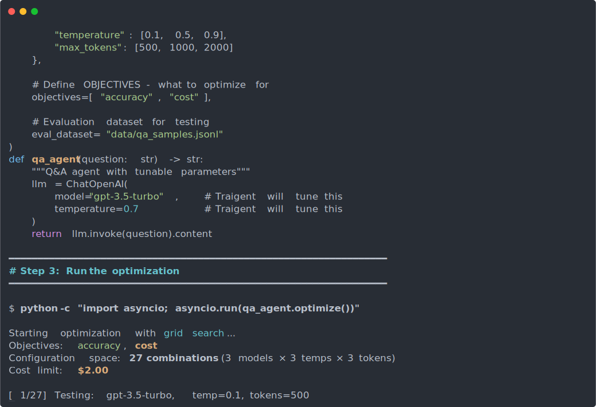
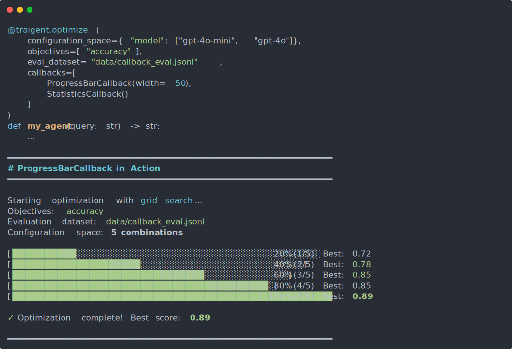
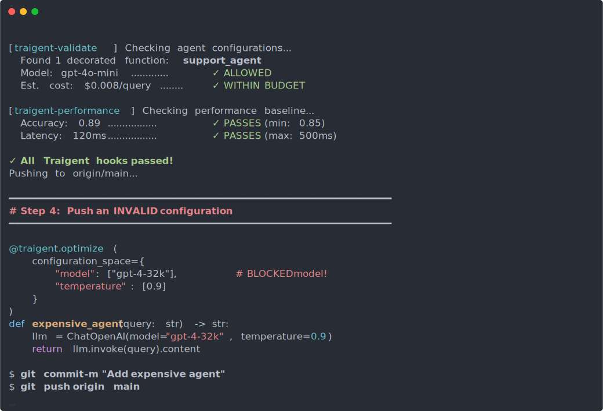

# ✨ Traigent: Find the Perfect AI Parameters for Your Task - Zero Code Changes Required

**Current Version**: 0.10.0 (Beta)

---

## Cost Warning

Traigent optimizes LLM applications by running multiple trials across configurations.
**This can result in significant API costs.**

| Recommendation      | How                                                         |
| ------------------- | ----------------------------------------------------------- |
| Development/Testing | Use `TRAIGENT_MOCK_LLM=true`                               |
| Control Spending    | Set `TRAIGENT_RUN_COST_LIMIT=2.0` (default: $2 USD per run) |
| Before Production   | Review the [DISCLAIMER.md](DISCLAIMER.md)                   |

**Important**: Cost estimates are approximations. Actual billing is determined by your LLM provider.

---

## Navigation

| | |
| --- | --- |
| **Get started** | [Installation](docs/getting-started/installation.md) · [5-minute tutorial](docs/getting-started/GETTING_STARTED.md) · [Quick Example](#-quick-example-see-tuned-variables-in-action) |
| **User guides** | [Injection Modes](docs/user-guide/injection_modes.md) · [Configuration Spaces](docs/user-guide/configuration-spaces.md) · [Tuned Variables](docs/user-guide/tuned_variables.md) · [Evaluation](docs/user-guide/evaluation_guide.md) |
| **Advanced** | [Agent Optimization](docs/user-guide/agent_optimization.md) · [Optuna Integration](docs/user-guide/optuna_integration.md) · [JS Bridge](docs/guides/js-bridge.md) |
| **API reference** | [Decorator Reference](docs/api-reference/decorator-reference.md) · [Constraint DSL](docs/features/constraint-dsl.md) |
| **Contributing** | [Contributing Guide](docs/contributing/CONTRIBUTING.md) · [Architecture](docs/architecture/ARCHITECTURE.md) |

---

Start with the curated experiments in `examples/`—each scenario ships with a README plus ready-to-run commands (including the required `export` statements) so you can iterate locally without guessing the setup.

> 💡 **Interactive Demos & Use Cases**: Advanced examples, use-cases, playground UI, and demos have been moved to [TraigentDemo](https://github.com/Traigent/TraigentDemo). The core SDK examples remain in `examples/` and `walkthrough/`.

> **Note**: Research papers and experimental code are in separate repositories:
>
> - [TraigentDemo](https://github.com/Traigent/TraigentDemo) - Use cases, playground, demos
> - [Traigent-Experiments](https://github.com/Traigent/Traigent-Experiments) - Research papers

## 🎬 See Traigent in Action

> Click any demo to play the animated version.

### LLM Agent Optimization

[](docs/demos/output/optimize.svg)

### Optimization Callbacks

[](docs/demos/output/hooks.svg)

### Agent Configuration Hooks

[](docs/demos/output/github-hooks.svg)

## 🏗️ Architecture Overview



**How it works:**

1. **Suggest**: The optimizer proposes a configuration to test
2. **Inject**: Traigent overrides your function's parameters with the proposed config
3. **Evaluate**: Your function runs against the dataset, scored by the evaluator
4. **Record**: Results update the optimizer's model
5. **Continue**: Loop continues until budget/trials exhausted, then outputs results

## 🚀 Quick Example: See Tuned Variables in Action

> **Want to run this now?** First [install Traigent](#-quick-installation), then use the ready-to-run quickstart examples (no API keys needed):
>
> ```bash
> export TRAIGENT_MOCK_LLM=true
> python examples/quickstart/01_simple_qa.py
> ```
>
> The `examples/quickstart/` directory contains runnable versions that work without API keys.

```python
import traigent
from langchain_openai import ChatOpenAI
from dotenv import load_dotenv
from traigent.api.decorators import EvaluationOptions, ExecutionOptions

# Load environment variables (API keys, etc.)
load_dotenv()

@traigent.optimize(
    configuration_space={
        "model": ["gpt-3.5-turbo", "gpt-4o-mini", "gpt-4o"],  # 🎯 Tuned Variable #1
        "temperature": [0.1, 0.5, 0.9]                         # 🎯 Tuned Variable #2
    },
    objectives=["accuracy", "cost"],    # What to optimize for
    # Dataset file path (relative to examples/datasets/quickstart/)
    evaluation=EvaluationOptions(eval_dataset="data/qa_samples.jsonl"),
    execution=ExecutionOptions(execution_mode="edge_analytics"),
)
def simple_qa_agent(question: str) -> str:
    """Simple Q&A agent with Tuned Variables"""

    # These values will be automatically optimized by Traigent!
    llm = ChatOpenAI(
        model="gpt-3.5-turbo",     # 🎯 Traigent tests: gpt-3.5-turbo, gpt-4o-mini, gpt-4o
        temperature=0.7            # 🎯 Traigent tests: 0.1, 0.5, 0.9
    )

    # Normal LLM invocation - Traigent intercepts and optimizes
    response = llm.invoke(f"Question: {question}\nAnswer:")
    print(f"🔧 Using: model={llm.model_name}, temp={llm.temperature}")
    return response.content

# That's it! Traigent will find the best model & temperature for YOUR specific use case
```

## 📊 Full Customer Support Example with RAG

```python
import asyncio
import traigent
from langchain_openai import ChatOpenAI
from langchain_chroma import Chroma
from dotenv import load_dotenv
from traigent.api.decorators import EvaluationOptions

# Load environment variables (API keys, etc.)
load_dotenv()

# Define your knowledge base (used during optimization and inference)
KNOWLEDGE_BASE = [
    "Returns accepted within 30 days with original receipt",
    "Free shipping on orders over $50",
    "Contact support@example.com for order issues",
]

@traigent.optimize(
    configuration_space={
        "model": ["gpt-3.5-turbo", "gpt-4o-mini", "gpt-4o"],
        "temperature": [0.1, 0.5, 0.9],
        "k": [3, 5, 10]  # RAG retrieval depth
    },
    objectives=["accuracy", "cost"],
    evaluation=EvaluationOptions(eval_dataset="rag_feedback.jsonl"),
)
def customer_support_agent(query: str, knowledge_base: list = KNOWLEDGE_BASE) -> str:
    """Answer customer questions using RAG"""

    # Your existing code - Traigent optimizes these automatically!
    llm = ChatOpenAI(
        model="gpt-3.5-turbo",     # Current: gpt-3.5-turbo
        temperature=0.7            # Current: 0.7
    )

    vectorstore = Chroma.from_texts(knowledge_base)
    docs = vectorstore.similarity_search(query, k=5)  # Current: k=5
    context = "\n".join([doc.page_content for doc in docs])

    response = llm.invoke(f"Context: {context}\nQuestion: {query}\nAnswer:")
    print(f"🔧 Using: {llm.model_name}, temp={llm.temperature}, k={len(docs)}")
    return response.content

# Step 1: Find optimal configuration
# Note: algorithm and max_trials are passed to .optimize(), not the decorator
results = asyncio.run(customer_support_agent.optimize(
    algorithm="random",  # Options: "random", "grid", "bayesian"
    max_trials=20        # Number of configurations to test
))

# Step 2: Apply best configuration
customer_support_agent.apply_best_config(results)

# Step 3: Use optimized agent (uses default KNOWLEDGE_BASE, or pass custom)
answer = customer_support_agent("What's your return policy?")
# 🔧 Using: gpt-4o-mini, temp=0.1, k=3  # ← Shows optimized parameters!

# Step 4: View optimization results
print(f"Best config: {results.best_config}")
print(f"Best score: {results.best_score}")
# Output:
# Best config: {'model': 'gpt-4o-mini', 'temperature': 0.1, 'k': 3}
# Best score: 0.94
```

### Need custom weights or minimize a different metric?

Lists like `["accuracy", "cost"]` are fine for most runs—Traigent automatically infers sensible orientations and equal weights. When you want explicit control, provide an `ObjectiveSchema`:

```python
from traigent.core.objectives import ObjectiveDefinition, ObjectiveSchema

custom_objectives = ObjectiveSchema.from_objectives(
    [
        ObjectiveDefinition("accuracy", orientation="maximize", weight=0.7),
        ObjectiveDefinition("cost", orientation="minimize", weight=0.3),
    ]
)

@traigent.optimize(
    objectives=custom_objectives,
    configuration_space={
        # Use tuples for continuous ranges, lists for categorical values
        "temperature": (0.0, 1.0),  # Continuous range
        "top_p": (0.1, 1.0),        # Continuous range
        "model": ["gpt-3.5-turbo", "gpt-4o-mini"],  # Categorical
    },
    eval_dataset="data/qa_samples.jsonl",
)
def weighted_agent(question: str) -> str:
    llm = ChatOpenAI(model="gpt-3.5-turbo", temperature=0.5)
    return llm.invoke(f"Answer concisely: {question}").content
```

> **Tip**: See `examples/quickstart/03_custom_objectives.py` for a complete working example.

### Injection modes & default values

Traigent can inject parameters in two ways:

- **Seamless (default)**: your original literals remain in place until a trial overrides them. Provide `default_config={"temperature": 0.3}` if you want a different starting point for the first trial or a new value for `reset()`.
- **Parameter mode** (`injection_mode="parameter"`): Traigent passes a `TraigentConfig` (built from your `default_config`) into the parameter you nominate (e.g. `config`). Access values with `config.get("foo", fallback)` so missing keys fall back cleanly when the default config is empty or partial.

**↗️ Try Traigent now - see the results above in under 5 minutes!**

### TVL Specs: The Foundation Layer

TVL (Traigent Validation Language) defines the _what_—constraints, objectives, and boundaries—while leaving the _how_ to any compatible optimizer. The power is in the specification, not the implementation.

```python
@traigent.optimize(tvl_spec="docs/tvl/tvl-website/client/public/examples/ch1_motivation_experiment.tvl.yml")
def rag_agent(query: str) -> str:
    llm = ChatOpenAI(model="gpt-4o-mini", temperature=0.5)
    docs = vectorstore.similarity_search(query, k=5)
    context = "\n".join(d.page_content for d in docs)
    return llm.invoke(f"Context: {context}\nQuestion: {query}").content
```

TVL sections control the configuration space, objectives, constraints, and budgets—no
extra arguments required. The CLI also accepts `traigent optimize ... --tvl-spec path`
and an optional `--tvl-environment staging` flag.

> 💡 **Why specifications matter**: A TVL spec can be validated by any conformant tool—Traigent today, your internal optimizer tomorrow. The foundation is the contract, not the implementation.

## 📦 Quick Installation

### Requirements

| Requirement  | Supported                                |
|--------------|------------------------------------------|
| **Python**   | 3.11, 3.12, 3.13, 3.14                   |
| **Platform** | Linux (tested on Ubuntu), macOS, Windows |

> **Note:** CI testing runs on Ubuntu Linux. macOS and Windows are expected to work but are not continuously tested.

**Recommended (pip):**

```bash
git clone https://github.com/Traigent/Traigent.git
cd Traigent
python3 -m venv .venv && source .venv/bin/activate
pip install -e ".[integrations]"   # Core + LangChain/OpenAI/Anthropic
python -c "import traigent; print('✅ Traigent ready')"
```

**Faster (uv):**

```bash
git clone https://github.com/Traigent/Traigent.git
cd Traigent
uv venv && source .venv/bin/activate
uv pip install -e ".[integrations]"
python -c "import traigent; print('✅ Traigent ready')"
```

> Not on PyPI yet—install from source using the commands above.

### Environment Configuration

#### Mock Mode

For local development and testing without API keys:

```bash
export TRAIGENT_MOCK_LLM=true
```

**What mock mode does:**

- Returns simulated responses from your decorated functions (no real LLM calls)
- Skips Traigent backend/cloud connections
- Generates realistic mock metrics (accuracy, cost, latency) for testing

**What mock mode does NOT do:**

- It does not disable the optimization loop itself—trials still run, configs are still tested
- It does not affect compute resources or parallelism

#### Restricted Environments

If running in containers, CI, or environments with limited permissions, you may see errors or warnings. Set these variables as needed:

```bash
export TRAIGENT_RESULTS_FOLDER=./results   # If home directory isn't writable
export LOKY_MAX_CPU_COUNT=1                # If you see joblib/semaphore permission errors
```

#### Local Storage

Optimization results are stored in `.traigent_local/` in your working directory (or customize with `local_storage_path` parameter). Logs go to `TRAIGENT_RESULTS_FOLDER` (defaults to `~/.traigent`).

#### Working with Past Results

After running an optimization, you can access and reuse results in several ways:

```python
# During or after optimization - get the current config
result = await my_agent.optimize(algorithm="random", max_trials=10)
print(result.best_config)   # {'model': 'gpt-4o-mini', 'temperature': 0.1}
print(result.best_score)    # 0.94

# Apply best config for future calls
my_agent.apply_best_config(result)

# Later, check what config is active
print(my_agent.current_config)  # Shows the applied config
```

**Inspecting saved runs:**

- Results are stored in `.traigent_local/experiments/<function_name>/runs/<timestamp>/`
- Each run directory contains `config.json`, `metrics.json`, and trial data
- Use `traigent results` CLI to list past runs
- Use `traigent plot <result_name>` to visualize optimization progress

**Reusing a previous config without re-optimizing:**

```python
# If you know the config you want to use
my_agent.apply_config({"model": "gpt-4o-mini", "temperature": 0.1, "k": 3})

# Or inside the function, access the current trial/applied config
@traigent.optimize(
    configuration_space={"model": ["gpt-4o-mini", "gpt-4o"], "temperature": [0.1, 0.5]},
    objectives=["accuracy", "cost"],
    eval_dataset="data/qa_samples.jsonl",
)
def my_agent(query: str) -> str:
    config = traigent.get_config()  # Works during optimization and after apply
    llm = ChatOpenAI(model=config.get("model"), temperature=config.get("temperature"))
    return llm.invoke(f"Answer: {query}").content
```

### ☁️ Traigent Cloud

Connect your SDK to the Traigent cloud to see optimization results in the [portal](https://portal.traigent.ai).

**Quick start (3 steps):**

1. Install the SDK:
   ```bash
   pip install -e ".[integrations]"
   ```

2. Log in:
   ```bash
   TRAIGENT_BACKEND_URL=https://api.traigent.ai traigent auth login
   ```

3. Run your optimization — results appear in the portal automatically:
   ```bash
   python playground.py
   ```

No environment variables needed after login — the SDK picks up stored credentials automatically.

**Credential priority order:**

| Credential  | 1st (highest)              | 2nd                        | 3rd (default)       |
|-------------|----------------------------|----------------------------|---------------------|
| API Key     | `TRAIGENT_API_KEY` env var | Stored CLI credentials     | None (local only)   |
| Backend URL | `TRAIGENT_BACKEND_URL` env var | Stored CLI credentials | `localhost:5000`    |

> **Tip:** Use env vars for CI/automation. Use `traigent auth login` for local development.

### Testing Models from Multiple Providers

When optimizing across models from different providers (OpenAI, Anthropic, Google, Mistral, etc.), we recommend using [LiteLLM](https://github.com/BerriAI/litellm) to provide a unified interface:

```python
import importlib
import traigent

@traigent.optimize(
    configuration_space={
        # Test models from multiple providers with a single interface
        "model": ["gpt-4o-mini", "claude-3-haiku-20240307", "gemini/gemini-pro"],
        "temperature": [0.1, 0.5, 0.9]
    },
    objectives=["accuracy", "cost"],
    eval_dataset="data/qa_samples.jsonl"
)
def multi_provider_agent(question: str) -> str:
    config = traigent.get_config()

    # Litellm is optional; import only when the dependency is installed
    litellm = importlib.import_module("litellm")
    completion = getattr(litellm, "completion")

    response = completion(
        model=config.get("model"),
        temperature=config.get("temperature"),
        messages=[{"role": "user", "content": question}]
    )
    return response.choices[0].message.content
```

LiteLLM supports 100+ LLM providers with a consistent API, making it easy to compare models across vendors during optimization.

### Available Feature Sets

When installing Traigent, you can choose specific feature sets:

| Feature Set      | Description                   | Use Case                         |
| ---------------- | ----------------------------- | -------------------------------- |
| `[core]`         | Basic functionality (default) | Minimal install                  |
| `[analytics]`    | Analytics and visualization   | View optimization results        |
| `[bayesian]`     | Bayesian optimization         | Advanced optimization algorithms |
| `[integrations]` | Framework integrations        | LangChain, OpenAI, Anthropic     |
| `[dev]`          | Development tools             | pytest, black, ruff, mypy        |
| `[all]`          | Complete installation         | All optional features            |

**Recommended installs:**

```bash
# For running examples and development
pip install -e ".[dev,integrations,analytics]"

# For everything (largest install)
pip install -e ".[all]"
```

### Next Steps

1. **Try the quickstart examples** (recommended first):

   ```bash
   export TRAIGENT_MOCK_LLM=true
   python examples/quickstart/01_simple_qa.py
   python examples/quickstart/02_customer_support_rag.py
   python examples/quickstart/03_custom_objectives.py
   ```

   > 💡 If you see `joblib will operate in serial mode` warnings, that's harmless—see [Restricted Environments](#restricted-environments) to suppress them.

2. **Run the curated walkthroughs**: Explore `examples/core/simple-prompt/run.py` and other examples (each README shows the `export` commands to copy)

3. **Set up API keys** (optional): Copy `.env.example` to `.env` and add your `OPENAI_API_KEY` or `ANTHROPIC_API_KEY`

4. **Deep dive**: Start with `examples/README.md` and `examples/docs/EXAMPLES_GUIDE.md` for experiment-specific instructions

> **Note**: `TRAIGENT_MOCK_LLM=true` runs examples without real API calls. The quickstart commands above include this export.

---

## 📏 Evaluation

Traigent evaluates your AI agent's performance by comparing outputs to expected results using semantic similarity, custom evaluators, or mock mode for testing.

**Quick Start:**

```python
# Simple evaluation with default semantic similarity
@traigent.optimize(
    configuration_space={
        "temperature": [0.1, 0.5, 0.9],
        "model": ["gpt-3.5-turbo", "gpt-4o-mini"]
    },
    eval_dataset="data/qa_samples.jsonl",  # JSONL format
    objectives=["accuracy", "cost"]
)
def my_agent(question: str) -> str:
    llm = ChatOpenAI(model="gpt-3.5-turbo", temperature=0.5)
    return llm.invoke(f"Answer: {question}").content
```

**Dataset Format (JSONL):** Each line must be valid JSON with these fields:

```jsonl
{"input": {"question": "What is AI?"}, "output": "Artificial Intelligence"}
{"input": {"question": "Explain ML"}, "output": "Machine learning uses data and algorithms"}
```

- `input` (required): Dictionary with your function's parameter names as keys
- `output` (optional): Expected output for accuracy evaluation

**Learn More:** See the [Evaluation Guide](docs/guides/evaluation.md) for:

- Dataset formats and creation
- Custom evaluator patterns (RAG, classification, code generation)
- Troubleshooting low accuracy
- Mock mode testing
- Best practices

## 🎯 Execution Modes

Traigent supports local execution with cloud modes planned:

| Mode                         | Status         | Privacy            | Algorithm            | Best For          |
| ---------------------------- | -------------- | ------------------ | -------------------- | ----------------- |
| **Local** (`edge_analytics`) | ✅ Available   | ✅ Complete        | Random/Grid/Bayesian | All use cases     |
| **Cloud**                    | 🚧 Coming Soon | ⚠️ Metadata        | Bayesian             | Production, teams |
| **Hybrid**                   | 🚧 Coming Soon | ✅ Execution local | Bayesian             | Balanced approach |

> Open-source builds run in `edge_analytics` today. Keep `execution_mode` at its default unless you're on a managed backend.

**Quick Start - Local Mode (Recommended):**

```python
@traigent.optimize(
    configuration_space={"model": ["gpt-4o-mini", "gpt-4o"], "temperature": [0.1, 0.5]},
    objectives=["accuracy", "cost"],
    eval_dataset="data/qa_samples.jsonl",
    execution_mode="edge_analytics",  # Full privacy, works today
    local_storage_path="./my_optimizations",
)
def my_agent(query: str) -> str:
    llm = ChatOpenAI(model="gpt-4o-mini", temperature=0.5)
    return llm.invoke(f"Answer: {query}").content
```

> **Local Storage**: When using `edge_analytics` mode, Traigent creates a `.traigent_local/` directory in your project root to store optimization state, trial results, and configuration data. This directory is automatically created on first run and can be safely deleted to reset optimization state. You can customize the location using the `local_storage_path` parameter.

**Learn More:** See the [Execution Modes Guide](docs/guides/execution-modes.md) for:

- Detailed mode comparisons and feature matrices
- Privacy-safe analytics and what data is tracked
- Intelligent upgrade recommendations
- Migration path from local to cloud
- Security best practices

### Optimization Parameters

| Parameter | Where | Description |
|-----------|-------|-------------|
| `configuration_space` | `@traigent.optimize()` decorator | Parameters to test (required) |
| `objectives` | `@traigent.optimize()` decorator | Metrics to optimize for |
| `eval_dataset` | `@traigent.optimize()` decorator | Dataset for evaluation |
| `algorithm` | `.optimize()` method call | Search algorithm: `"random"`, `"grid"`, `"bayesian"` |
| `max_trials` | `.optimize()` method call | Number of configurations to test |

## 🎯 Configuration Injection Modes

Traigent supports two ways to inject optimized parameters into your code:

### Seamless Mode (Default) - Zero Code Changes

Perfect for optimizing existing agents without refactoring:

```python
@traigent.optimize(
    configuration_space={"model": ["gpt-4o-mini", "gpt-4o"], "temperature": [0.1, 0.9]},
    objectives=["accuracy", "cost"],
    eval_dataset="data/qa_samples.jsonl",
)
def my_agent(query: str) -> str:
    llm = ChatOpenAI(model="gpt-4o-mini", temperature=0.7)  # Auto-optimized!
    return llm.invoke(query).content
```

Traigent automatically intercepts framework calls (`ChatOpenAI`, `as_retriever`, etc.) and injects optimized values.

### Parameter Mode - Explicit Control

For new development with full type safety:

```python
from traigent import TraigentConfig

@traigent.optimize(
    injection_mode="parameter",
    configuration_space={"model": ["gpt-4o-mini", "gpt-4o"], "k": [3, 5, 10]},
    objectives=["accuracy", "cost"],
    eval_dataset="data/qa_samples.jsonl",
)
def my_agent(query: str, config: TraigentConfig) -> str:
    llm = ChatOpenAI(model=config.get("model"))  # Explicit access
    docs = vectorstore.similarity_search(query, k=config.get("k"))
    context = "\n".join(d.page_content for d in docs)
    return llm.invoke(f"Context: {context}\nQuestion: {query}").content
```

**Which to use?**

- **Seamless**: Existing codebases, rapid adoption, zero migration
- **Parameter**: New development, type safety, complex logic

## 💻 CLI Commands

The CLI provides local optimization, validation, results management, and template generation:

```bash
# Help and version info
traigent --help
traigent --version   # Quick version check
traigent info        # Detailed version, features, and integrations

# Quiet mode (suppress logs) or verbose mode
traigent --quiet info    # Errors only
traigent --verbose info  # Full logging

# Algorithms
traigent algorithms

# Optimize decorated functions in a Python file
# Note: The module must have @traigent.optimize decorated functions with
# configuration_space and eval_dataset defined
traigent optimize path/to/module.py -a grid -n 10

# Validate dataset and configuration files
traigent validate path/to/dataset.jsonl -o accuracy -o cost
traigent validate_config config.json

# Generate local-only example-content map for FE report enrichment
# (contains input/output locally; never sent to backend unless you upload it manually)
traigent report-example-map --dataset data/qa_dataset.jsonl --output report_example_map.json

# Manage and visualize results
traigent results
traigent plot <result_name> -p progress

# Generate example templates
traigent generate -t basic -o traigent_example.py

# Verify optimization improves over defaults
traigent check path/to/module.py --threshold=10
```

## ✨ Key Features

- **Zero-Code Integration**: Add `@traigent.optimize()` to existing code - no refactoring needed
- **Multi-Algorithm Optimization**: Grid search, Random search, and Bayesian (TPE, NSGA-II)
- **Multi-Objective**: Optimize accuracy, latency, cost, and custom metrics simultaneously
- **Framework Support**: LangChain, OpenAI SDK, Anthropic, and any LLM provider
- **Cost Tracking**: Integrated tokencost library with 500+ model pricing
- **Parallel Execution**: Concurrent trials and example-level parallelism
- **Privacy-First**: Local execution mode keeps all data on your machine
- **Extensible**: Custom evaluators, metrics, and optimization strategies

### Parallel Execution

```python
@traigent.optimize(
    eval_dataset="data/qa_samples.jsonl",
    objectives=["accuracy", "cost"],
    configuration_space={
        "model": ["gpt-4o-mini", "gpt-4o"],
        "temperature": [0.1, 0.5, 0.9],
    },
    execution_mode="edge_analytics",
    parallel_config={"example_concurrency": 4, "trial_concurrency": 2},
)
def parallel_qa(question: str) -> str:
    llm = ChatOpenAI(model="gpt-4o-mini", temperature=0.5)
    return llm.invoke(f"Answer: {question}").content
```

### 💰 Cost Tracking

Cost is automatically tracked during optimization via the **tokencost** library (500+ models, all major providers):

```python
results = await my_agent.optimize()
print(f"Total optimization cost: ${results.total_cost:.4f}")
print(f"Best configuration cost per call: ${results.best_config_cost:.6f}")
```

## 🎓 More Examples

> **Interactive UI & advanced examples**: See the [TraigentDemo](https://github.com/Traigent/TraigentDemo) repository for Streamlit playground, use cases, and research benchmarks.

### Config Access Reference

| Context                         | API                           | Notes                                                         |
| ------------------------------- | ----------------------------- | ------------------------------------------------------------- |
| Inside the optimized function   | `traigent.get_config()`       | Unified access during optimization and after apply_best_config(). |
| During optimization (strict)    | `traigent.get_trial_config()` | Raises `OptimizationStateError` if no active trial.           |
| After optimization completes    | `result.best_config`          | Returned by `func.optimize()`.                                |
| When calling the function later | `func.current_config`         | Automatically set to the best config.                         |

### 🎯 Real-World: LangChain + OpenAI Optimization

```python
from langchain_openai import ChatOpenAI
from langchain_core.prompts import ChatPromptTemplate
import traigent

# Your existing LangChain code - unchanged!
def analyze_sentiment(text: str) -> str:
    llm = ChatOpenAI(model="gpt-4o-mini", temperature=0.5)
    prompt = ChatPromptTemplate.from_template(
        "Analyze sentiment of: {text}\nSentiment:"
    )
    chain = prompt | llm
    return chain.invoke({"text": text}).content

# Optimize it with zero code changes!
@traigent.optimize(
    eval_dataset="sentiment_test_set.jsonl",
    objectives=["accuracy", "cost"],
    configuration_space={
        "model": ["gpt-4o-mini", "gpt-4o"],
        "temperature": [0.0, 0.3, 0.7, 1.0]
    },
)
def analyze_sentiment_optimized(text: str) -> str:
    # EXACT SAME CODE - just add the decorator!
    llm = ChatOpenAI(model="gpt-4o-mini", temperature=0.5)
    prompt = ChatPromptTemplate.from_template(
        "Analyze sentiment of: {text}\nSentiment:"
    )
    chain = prompt | llm
    return chain.invoke({"text": text}).content
```

### 🔥 Multi-Framework Optimization

```python
# Works with any framework - OpenAI SDK example
import openai

@traigent.optimize(
    eval_dataset="translations.jsonl",
    objectives=["accuracy", "cost"],
    configuration_space={
        "model": ["gpt-4o-mini", "gpt-4o"],
        "temperature": [0.1, 0.5, 0.9],
        "max_tokens": [100, 500, 1000]
    },
)
def translate_text(text: str, target_language: str) -> str:
    # Your existing OpenAI code - no changes needed!
    response = openai.chat.completions.create(
        model="gpt-4o-mini",  # Will be overridden during optimization
        temperature=0.3,         # Will be overridden during optimization
        max_tokens=500,          # Will be overridden during optimization
        messages=[
            {"role": "system", "content": f"Translate to {target_language}"},
            {"role": "user", "content": text}
        ]
    )
    return response.choices[0].message.content
```

### 📊 Advanced: Multi-Objective with Cross-Provider Comparison

```python
@traigent.optimize(
    eval_dataset="complex_tasks.jsonl",
    objectives=["accuracy", "cost"],
    configuration_space={
        "model": ["gpt-4o-mini", "gpt-4o", "claude-3-5-haiku-latest"],
        "temperature": [0.0, 0.5, 1.0],
        "max_tokens": [100, 500, 2000]
    },
)
def complex_reasoning_task(query: str) -> str:
    llm = ChatOpenAI(model="gpt-4o", temperature=0.7, max_tokens=1000)
    response = llm.invoke(
        f"Think step by step and answer:\n{query}"
    )
    return response.content
```

## 📚 Pre-built Examples

Each example in `examples/core/` includes a complete `run.py`, datasets, and mock mode support. See `examples/README.md` for the full list.

```bash
export TRAIGENT_MOCK_LLM=true
python examples/core/simple-prompt/run.py
```

## 📚 Documentation

- **[Quick Start Guide](docs/getting-started/GETTING_STARTED.md)**: Get started in 5 minutes
- **[TraigentDemo Repository](https://github.com/Traigent/TraigentDemo)**: Use cases, playground, demos
- **[Architecture Guide](docs/architecture/ARCHITECTURE.md)**: Technical design details
- **[Secrets Management](docs/guides/secrets_management.md)**: Secure AWS-backed workflow
- **[Examples](examples/)**: Working code examples
- **[Evaluation Guide](docs/guides/evaluation.md)**: Dataset formats and custom evaluators
- **[Execution Modes](docs/guides/execution-modes.md)**: Local, cloud, and hybrid modes

## 🛠️ Development

### Project Structure

```
Traigent/
├── traigent/          # Main SDK package
│   ├── api/           # Public API and decorators
│   ├── core/          # Core orchestration logic
│   ├── optimizers/    # Optimization algorithms
│   ├── cloud/         # Cloud integration
│   └── integrations/  # Framework integrations
├── examples/          # Core SDK examples
├── walkthrough/       # Interactive tutorials
├── tests/             # Test suite
├── docs/              # Documentation
├── plugins/           # Optional plugins (analytics, tracing, OPAL, tuned variables, UI)
├── tools/             # Architecture analysis utilities
├── scripts/           # Development and automation scripts
├── configs/           # Configuration, baselines, and runtime
└── requirements/      # Dependency specifications
```

> See [docs/architecture/project-structure.md](docs/architecture/project-structure.md) for detailed structure.

### Development Setup

```bash
# Clone the repository
git clone https://github.com/Traigent/Traigent.git
cd Traigent

# Create virtual environment
python -m venv .venv && source .venv/bin/activate

# Install all development dependencies
pip install -e ".[all,dev]"

# Run tests (uses pytest-xdist for parallel execution)
make test
# Or directly:
TRAIGENT_MOCK_LLM=true TRAIGENT_OFFLINE_MODE=true pytest

# Format and lint
make format   # Black + isort
make lint     # Ruff + mypy + bandit

# Install pre-commit hooks
pre-commit install
```

## 🤝 Contributing

We welcome contributions! See the guidelines below for how to get started.

### Testing

```bash
# Run all tests
pytest

# Run with coverage
pytest --cov=traigent --cov-report=html

# Run specific test module
pytest tests/unit/test_api.py
```

### Areas for Contribution

- **🏗️ New AI Models**: Add support for Claude, Cohere, Edge Analytics models
- **🧠 Better Testing**: Improve subset selection algorithms
- **🎮 UI Features**: Enhance the Streamlit Playground
- **📊 Metrics**: Add domain-specific evaluation metrics
- **📖 Documentation**: Share your success stories
- **🐛 Bug Fixes**: Help improve reliability

## 📄 License

This project is licensed under the Apache License 2.0 - see the [LICENSE](LICENSE) file for details.

## 🔧 Troubleshooting

**Verify installation**: `python scripts/validation/verify_installation.py`

**Common issues:**

| Problem | Fix |
|---------|-----|
| `ModuleNotFoundError` | `pip install -e ".[integrations]"` or check your venv is activated |
| 0.0% accuracy | Set `TRAIGENT_MOCK_LLM=true` for demo mode, or check dataset format |
| Missing API keys | Copy `.env.example` to `.env` and add your keys; or use mock mode |
| Permission errors | Use `pip install --user` or create a fresh venv |
| Dependency conflicts | `pip install --upgrade pip` then try a fresh venv |

**Note**: README code examples show patterns but may need API keys. Use `examples/quickstart/` for ready-to-run examples with `TRAIGENT_MOCK_LLM=true`.

## 🌟 Community

- **[Discord](https://discord.gg/traigent)**: Join our community
- **[GitHub Issues](https://github.com/Traigent/Traigent/issues)**: Report bugs or request features
- **[GitHub Discussions](https://github.com/Traigent/Traigent/discussions)**: Ask questions and share ideas

---

**[Get Started](docs/getting-started/GETTING_STARTED.md)** | **[Examples](examples/)** | **[Evaluation Guide](docs/guides/evaluation.md)**
