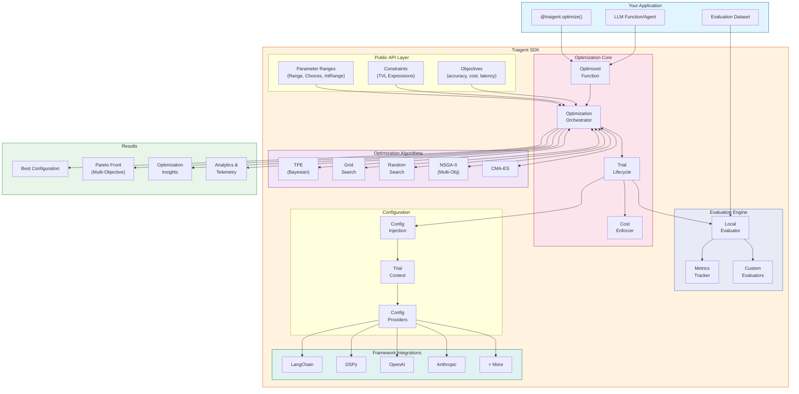
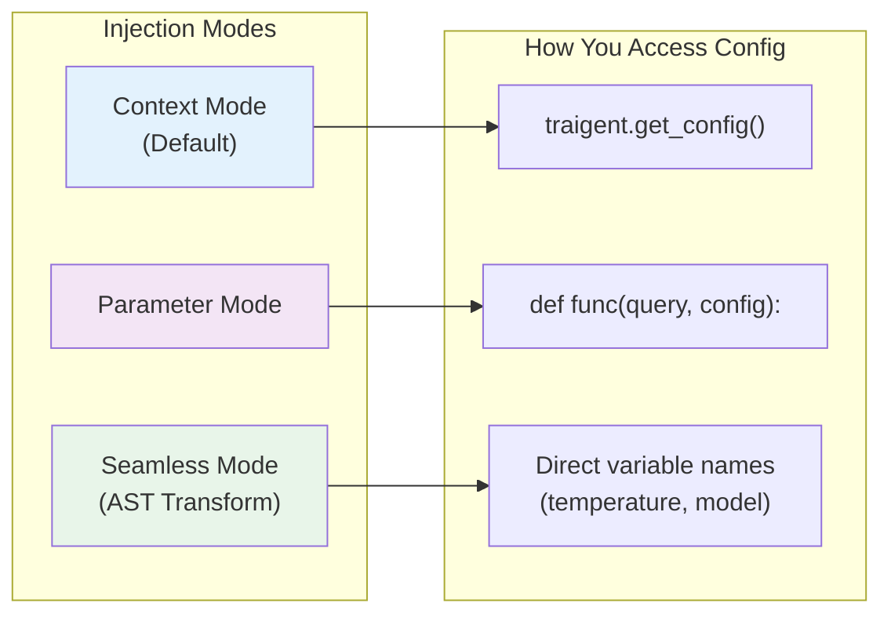
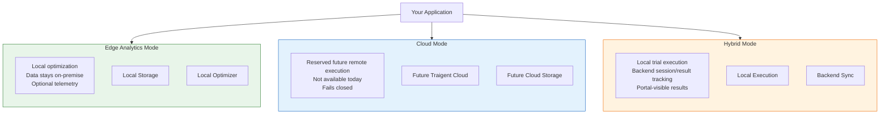
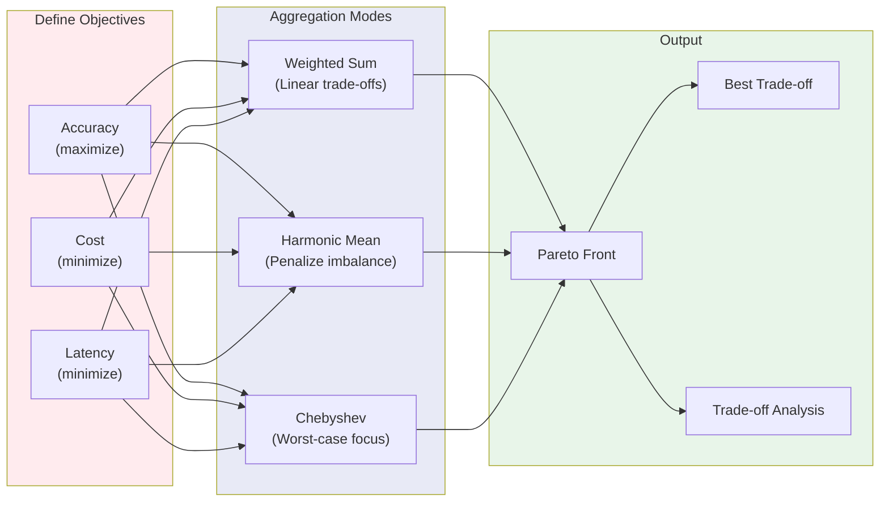
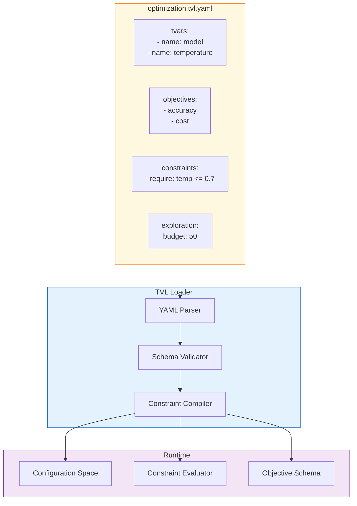
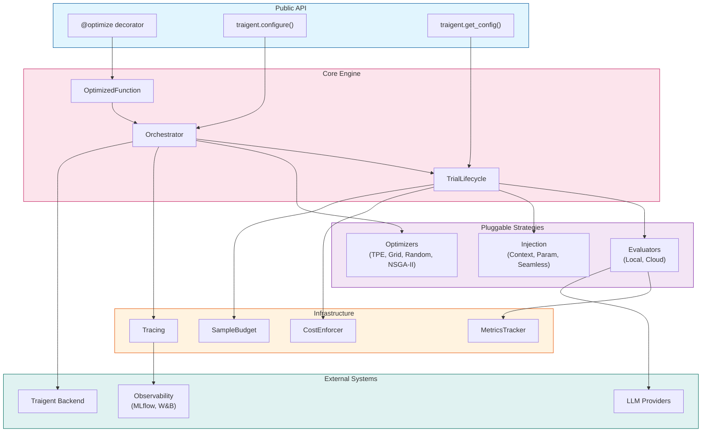

# Traigent SDK Architecture

## How it Works

Traigent is a zero-code LLM optimization SDK that automatically finds the best configuration for your AI workflows. It uses advanced optimization algorithms to explore parameter spaces while respecting constraints and budgets.

### Key Capabilities

- **Parameter Optimization**: Automatically tune model selection, temperature, prompts, and other parameters
- **Multi-Objective Optimization**: Balance accuracy, cost, latency, and other metrics simultaneously
- **Framework Integration**: Native support for LangChain, DSPy, OpenAI, Anthropic, and more
- **Flexible Execution**: Run locally (edge analytics) or in the cloud
- **TVL Specifications**: Define optimization specs in YAML for version control and collaboration

---

## High-Level Architecture



---

## Optimization Flow

```mermaid
sequenceDiagram
    participant User as Your Code
    participant OF as OptimizedFunction
    participant Orch as Orchestrator
    participant Opt as Optimizer
    participant Eval as Evaluator
    participant LLM as LLM Provider

    User->>OF: @traigent.optimize()
    User->>OF: func.optimize(dataset)

    OF->>Orch: Initialize optimization

    loop Until stopping condition
        Orch->>Opt: suggest_next_trial(history)
        Opt-->>Orch: config candidate

        Orch->>Orch: Acquire cost permit

        Orch->>Eval: evaluate(config, dataset)

        loop For each example
            Eval->>LLM: Execute with config
            LLM-->>Eval: Response + metrics
            Eval->>Eval: Run custom evaluators
        end

        Eval-->>Orch: TrialResult (metrics)
        Orch->>Opt: Update with result
        Orch->>Orch: Check stopping conditions
    end

    Orch-->>OF: OptimizationResult
    OF-->>User: Best config + insights
```

---

## Configuration Injection Modes

Traigent supports multiple ways to inject optimized configurations into your functions:



> A fourth function-attribute-based mode existed in v1.x but was removed in v2.x because it could not be made thread-safe under parallel trials. The wrapper still exposes the read-only `OptimizedFunction.current_config` property to inspect the active configuration after `apply_best_config()` — that is a separate surface, not an injection mode. See [User Guide / Section 4](../user-guide/injection_modes.md#4-attribute-mode-removed-in-v2x) for migration guidance.

---

## Execution Modes



---

## Multi-Objective Optimization



---

## TVL Specification System

TVL (Tuned Variable Language) lets you define optimization specs in YAML:



---

## Component Relationships



---

## Quick Start Example

```python
import traigent
from traigent import Range, Choices

@traigent.optimize(
    # Define parameter search space
    model=Choices(["gpt-4o", "gpt-4o-mini", "claude-3-sonnet"]),
    temperature=Range(0.0, 1.0),

    # Set optimization objectives
    objectives=["accuracy", "cost"],

    # Configure evaluation
    evaluation={"eval_dataset": "test_cases.jsonl"},

    # Set budget
    exploration={"budget": 50}
)
def my_agent(query: str) -> str:
    config = traigent.get_config()
    # Your LLM logic here
    return response

# Run optimization
result = my_agent.optimize()
print(f"Best config: {result.best_config}")
print(f"Accuracy: {result.best_metrics['accuracy']:.2%}")
```

---

## Learn More

- [Examples](../../examples/)
