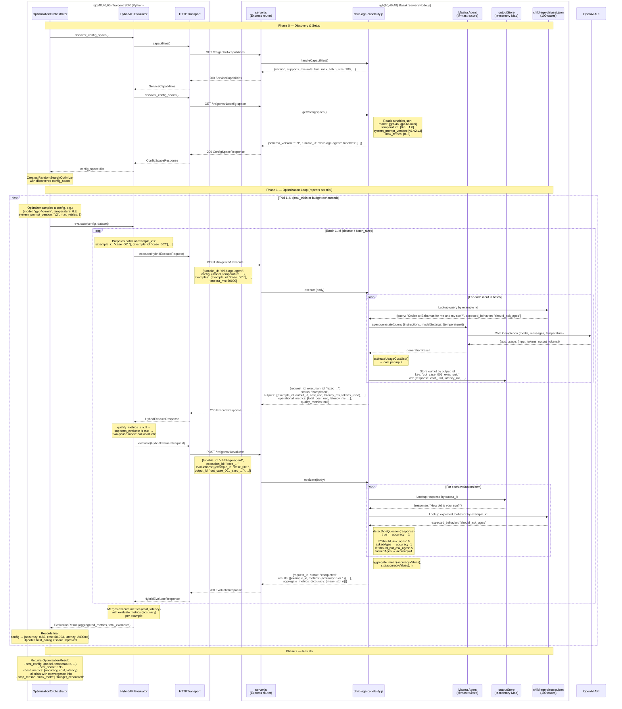
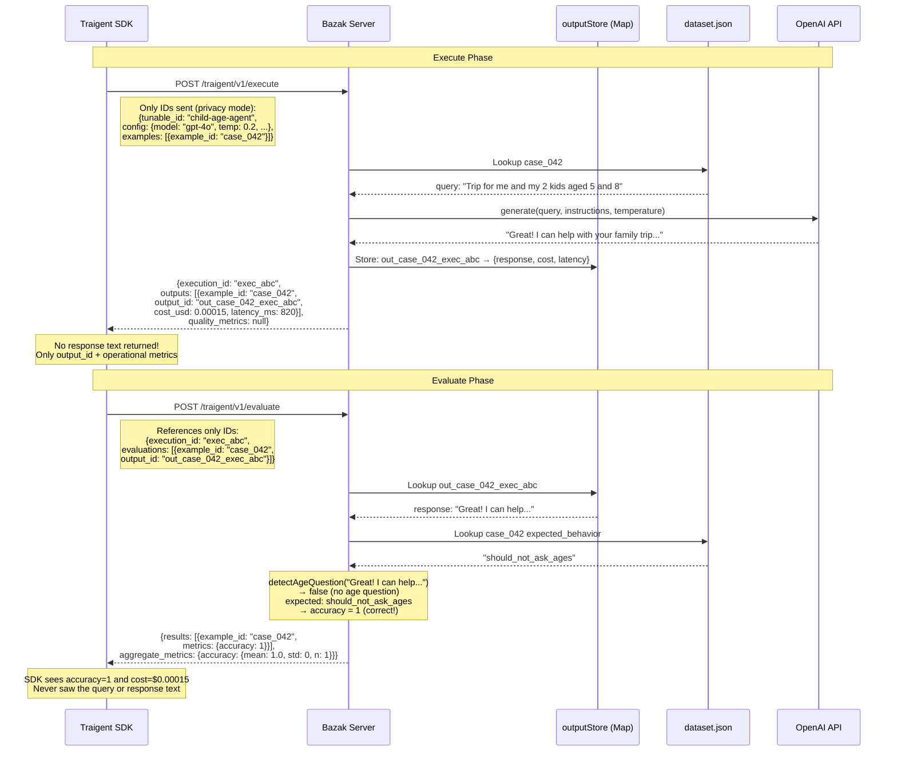
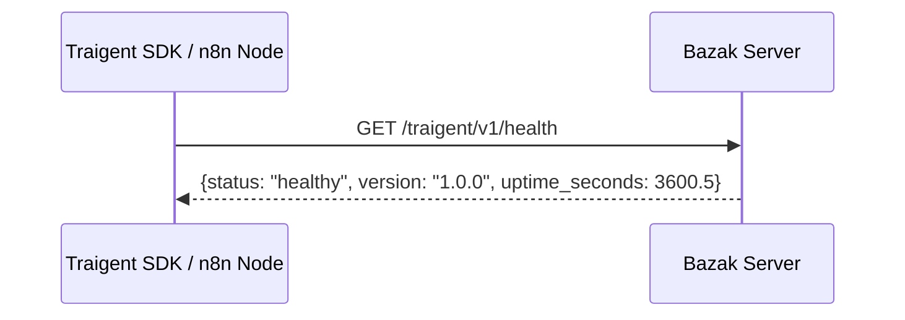

# Bazak Server <-> Traigent Client — Sequence Diagram

## Full Optimization Loop (Two-Phase Mode)

Shows the actual flow between Traigent SDK (`HybridAPIEvaluator` + `OptimizationOrchestrator`)
and the Bazak server (`child-age-capability.js` via `server.js`), as implemented in
`run_mastra_js_optimization.py`.

## Single Trial Detail (Privacy Mode — Bazak Default)

Zoomed-in view of one execute+evaluate cycle in privacy mode,
where only `example_id` and `output_id` cross the wire (no actual query/response text).

## Health Check (used by credentials test and pre-flight)

