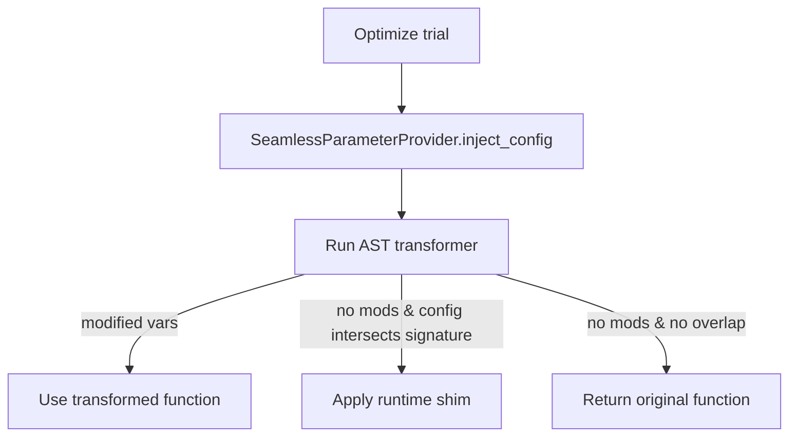

# Seamless Injection Runtime Fallback – Detailed Feature Plan

## 1. Background & Problem Statement

TraiGent’s `injection_mode="seamless"` relies on an AST transformer to rewrite in-function assignments (e.g. `model = "claude"`). This works for users who explicitly assign configuration values inside the function body, but it fails for common patterns where configuration lives solely in:

- **Signature defaults** (`def fn(model="claude")`)
- **Keyword-only parameters** (`def fn(*, model="claude")`)
- **Required parameters that are never passed by the caller** (`def fn(model): ...`)
- **Direct call arguments** (`ChatAnthropic(model="claude")` inside the function)

In these cases, the AST transformer does not modify anything, so the optimizer’s sampled configuration is never applied—even though TraiGent records trial configs as if they were used. Anthropic logs confirmed the issue: all requests were sent to the default model despite multiple configs appearing in the results table.

Our goal is to guarantee that all configurations sampled by the optimizer are actually used during evaluation, without sacrificing the safety guarantees of the seamless provider, and without demanding users sprinkle explicit assignments through their code.

## 2. Design Overview

We adopt a **hybrid strategy**:

1. **Attempt AST rewrite first** (existing behaviour). If the transformer replaces at least one assignment, we keep using the transformed function—no change to the hot path.
2. **Fallback to a runtime shim** when the transformer cannot modify anything but configuration keys overlap with function parameters (defaults, keyword-only, required). The shim binds parameters at call time and injects config values safely.

This balancing act preserves all current behaviour for assignment-based functions while covering the missing cases in a deterministic, thread-safe way. It works across execution modes (edge_analytics, hybrid, cloud) and with parallel trials, because injection still happens locally per invocation.

### 2.1 Flow Diagram



### 2.2 Fallback Detection Logic

Claude’s review highlighted that `if not modified_vars and config` is too coarse. We refine the condition:

```python
sig = inspect.signature(func)
param_names = set(sig.parameters.keys())
config_in_params = bool(param_names & config.keys())
should_shim = (not transformer.modified_vars) and config and config_in_params
```

If `should_shim` is true, we apply the shim.

## 3. Runtime Shim Design

### 3.1 Requirements
- Respect caller overrides (if user passes `model="manual"`, do not override).
- Handle positional args, defaults, keyword-only args, varargs, varkw.
- Work for async functions.
- Avoid mutating bound arguments in place to prevent side effects.
- Preserve caching semantics and avoid double-wrapping.

### 3.2 Reference Implementation

```python
def _apply_runtime_shim(func: Callable, config: dict[str, Any]) -> Callable:
    sig = inspect.signature(func)

    def shimmed(*args, **kwargs):
        bound = sig.bind_partial(*args, **kwargs)
        bound.apply_defaults()

        new_kwargs = dict(kwargs)

        for name, param in sig.parameters.items():
            if name not in config:
                continue

            if name in kwargs:
                # Caller explicitly supplied value; respect it.
                continue

            if name in bound.arguments and bound.arguments[name] is not param.default:
                # Positional argument supplied; do not override.
                continue

            new_kwargs[name] = config[name]

        return func(*bound.args, **new_kwargs)

    if inspect.iscoroutinefunction(func):
        async def async_shimmed(*args, **kwargs):  # pragma: no cover
            return await shimmed(*args, **kwargs)
        return functools.wraps(func)(async_shimmed)

    return functools.wraps(func)(shimmed)
```

- Works for keyword-only parameters because `bind_partial` respects the signature’s `*` separator.
- Supports methods; `self`/`cls` remain positional and aren’t overridden.
- `kwargs` wins (user override). `config` only fills missing/defaulted parameters.
- Does not attempt to mutate `bound.arguments` directly.

### 3.3 Nested LLM Calls
The shim injects values into function parameters; it does not rewrite call sites. Therefore:
- Direct assignments (`model = ...`) still handled by AST path.
- Signature defaults now honoured by shim.
- **Calls like `ChatAnthropic(model="claude")` continue to use the literal**. We document this as a limitation and consider future call-site injection (Phase 4).

## 4. Caching & Performance

- Use the same cache key derivation as today (config hash + function identity). Shimmed functions are cached just like transformed ones; this prevents redundant signature processing.
- `inspect.signature` has overhead; we cache the signature per function (e.g., in `SeamlessParameterProvider` instance).
- LRU eviction logic remains unchanged.
- Telemetry counters track fallback usage:
  ```python
  self.stats["ast_rewrites"] += 1
  self.stats["runtime_shims"] += 1
  self.stats["fallback_triggers"].append(reason)
  ```

## 5. Edge Cases & Modes

| Scenario | Handling |
|----------|----------|
| **Keyword-only parameters** | Shim respects `*` separator; overrides missing defaults. |
| **Class/instance methods** | First argument (`self`/`cls`) remains positional; shim injects rest. |
| **Async functions** | Async shim wraps synchronous shim to preserve coroutine behaviour. |
| **Parallel trials** | Each trial gets its own wrapped function keyed by config hash; thread-safe. |
| **Execution modes (edge_analytics, hybrid, cloud)** | Injection happens locally before evaluation; deterministic across modes. |
| **Direct LLM kwargs** | Not modified in this phase; documented limitation (see §8). |
| **Dynamic attribute access** (`getattr`) | Out of scope; unchanged. |

## 6. Testing Strategy

### 6.1 Unit Tests

File: `tests/functional/test_seamless_runtime_shim.py`

1. **default_only** – function with signature defaults, no assignments. Ensure trial configs appear in outputs. Fails today, passes post-change.
2. **required_param** – function with required parameters (no defaults); optimizer injects value even when caller omits argument.
3. **keyword_only** – `def fn(*, model="haiku"):` scenario.
4. **method_defaults** – class method `def process(self, text, model="haiku")`.
5. **async_default** – async function to verify coroutine shim.

### 6.2 Regression

- Preserve existing assignment-based behaviour (`model = "haiku"` inside function). Confirm AST rewrite path still applies (no shim). Add logging assertion that `runtime_shim` counter stays zero.

### 6.3 Parallelism / Concurrency

- Integration test with `parallel_trials=3` and `max_trials=6`. Use deterministic mock to detect misapplied configs.

### 6.4 Telemetry

- Snapshot test verifying debug log when shim engages.

All new tests must fail on current main and pass with the updated provider.

## 7. Documentation & Observability

- Update SDK docs / README explaining supported patterns:
  - ✅ Variable assignments (`model = ...`)
  - ✅ Signature defaults (`def fn(model="...")`)
  - ✅ Required parameters (optimized injection)
  - ⚠️ Direct call arguments (`ChatAnthropic(model="...")` still literal)
  - ❌ Dynamic attribute lookups (unchanged)
- Release notes entry: “Fix: seamless injection now applies configs to function parameters without explicit assignments.”
- Optional: add debug log showing whether AST rewrite or shim was used per function.

## 8. Future Work (Phase 4+)

- **Call-site injection**: explore AST visitor for `ast.Call` nodes to pattern-match common LLM usage (e.g., `ChatAnthropic(model=...)`). Requires strict safety checks and likely 
a feature flag.
- **Config usage telemetry**: export counts to analytics backend for monitoring adoption.
- **User hints**: if we detect literal strings in common LLM constructors, emit a warning suggesting the user rely on config injection instead.

## 9. Risk Assessment

| Risk | Severity | Mitigation |
|------|----------|------------|
| Performance regression | Low | Cache signatures and shimmed functions; reuse LRU. |
| Incorrect parameter override | Medium | Precedence rules favour caller arguments; tests confirm behaviour. |
| Async handling regression | Low | Explicit async wrapper. |
| Memory growth via cache | Low | Existing LRU eviction applies to shimmed functions. |

## 10. Implementation Steps & Timeline

1. **Runtime shim helper** (`runtime_injector.py`) + provider integration. (2 days)
2. **Signature caching & detection logic** enhancements. (0.5 day)
3. **Telemetry counters** for ast vs shim vs fallback reasons. (0.5 day)
4. **Test suite expansion** (unit + integration). (1 day)
5. **Docs + release notes**. (0.5 day)
6. **QA sweep across execution modes** (scripts for edge/hybrid/cloud, parallel trials). (0.5 day)
7. Optional: expose telemetry metric to CLI or logs for early adopters. 

Feature flag not required; the behaviour is backward compatible and only triggers when assignments are absent.

---

With these adjustments, seamless injection becomes reliable for the most common real-world patterns while staying secure and deterministic. Future iterations can build on this foundation to handle call-site literals when we have robust heuristics or user opt-in mechanisms.
