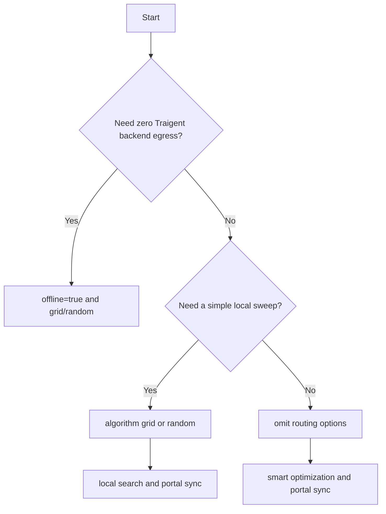

# Choosing the Right Optimization Model

Most users do not need to choose. With `TRAIGENT_API_KEY` set, omit routing
options and Traigent uses smart optimization with portal result sync.

Use the two public knobs only when you have a specific routing requirement:

- `algorithm`: `"auto"` by default, `"grid"` / `"random"` for local search, or a
  cloud-required smart algorithm name.
- `offline`: `False` by default; set `True` for zero Traigent backend egress.

Trials run in your process. The cloud optimizer suggests configurations; it does
not execute your dataset examples remotely.

## Decision Guide



## Options

| Request | What happens | Portal sync |
| --- | --- | --- |
| Omit routing settings | Default smart optimization | Yes |
| `algorithm="grid"` or `"random"` | Local search in your Python process | Yes |
| Smart algorithm name | Cloud-required optimizer | Yes |
| `offline=True` | Local only, zero Traigent backend egress | No |

## Default Smart Optimization

```python
@traigent.optimize(
    evaluation={"eval_dataset": "evals.jsonl"},
    configuration_space={"model": ["gpt-4o-mini", "gpt-4o"]},
    objectives=["accuracy"],
)
def agent(question: str) -> str:
    return answer_question(question)

result = agent.optimize(max_trials=8)
```

## Explicit Local Search

Use `grid` or `random` for reproducible sweeps, CI smoke tests, and simple
baselines. These runs still sync results to the portal when authenticated.

```python
result = agent.optimize(algorithm="grid", max_trials=8)
```

## No-Egress Local Runs

Use `offline=True` only when no Traigent backend traffic is allowed.

```python
@traigent.optimize(
    evaluation={"eval_dataset": "evals.jsonl"},
    configuration_space={"temperature": [0.0, 0.3, 0.7]},
    objectives=["accuracy"],
    offline=True,
)
def sensitive_agent(question: str) -> str:
    return answer_question(question)

result = sensitive_agent.optimize(algorithm="grid", max_trials=8)
```

`offline=True` does not block calls your function makes to LLM providers,
databases, or tools.

## Smart Algorithms

Explicit smart algorithms run in the cloud only:

```python
result = agent.optimize(algorithm="bayesian", max_trials=20)
```

They hard-error when cloud optimization is unavailable or `offline=True` is set.
Use the default path when you want Traigent to pick the best available option.

## Migration Note

Legacy `execution_mode=...` inputs are deprecated. Remove them for the default
path. Use `offline=True` only for no-egress local runs, and use
`algorithm="grid"` or `"random"` for local search that can still sync results.
