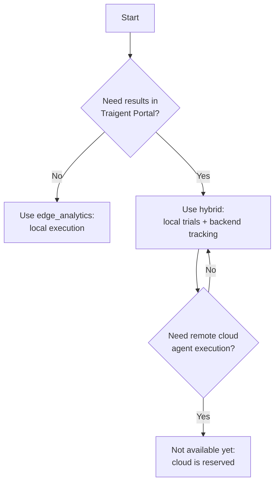

# Choosing the Right Optimization Model

Traigent SDK currently supports local execution and portal-tracked local execution. This guide separates supported modes from future remote execution paths.

> **Current status:** Use `execution_mode="edge_analytics"` for fully local runs and `execution_mode="hybrid"` for portal-tracked runs where trials still execute locally. `execution_mode="cloud"` and managed remote agent execution are not implemented yet and fail closed with guidance to use `hybrid`.

## Quick Decision Guide



## Model Comparison

### Supported: Local Optimization (`edge_analytics`)

**How it works:**

- Optimization and function execution happen locally
- Results are stored locally unless optional analytics/backend settings are configured
- No Traigent backend dependency when `TRAIGENT_OFFLINE_MODE=true`

**Best for:**

- Custom functions that can't be serialized
- Sensitive data that must stay local
- Low-latency requirements
- Non-standard execution environments

**Example use cases:**

- Optimizing proprietary algorithms
- Healthcare/financial applications with data privacy requirements
- Hardware-in-the-loop optimization
- Real-time systems

### Supported: Hybrid Portal Tracking (`hybrid`)

**How it works:**

- SDK creates a backend-tracked optimization session
- Trials and LLM calls execute locally
- Trial metrics are submitted to the backend so results appear in the portal

**Best for:**

- Teams that want website-visible optimization runs
- Local execution with centralized session and metric tracking
- Production runs where prompts, inputs, and outputs should remain local

**Example use cases:**

- Chatbot optimization
- Content generation tuning
- Question-answering systems
- Code generation agents

## Detailed Comparison Table

| Aspect                 | `edge_analytics`           | `hybrid`                       | `cloud`               |
| ---------------------- | -------------------------- | ------------------------------ | --------------------- |
| **Current Status**     | Supported                  | Supported                      | Not implemented       |
| **Execution Location** | Local client               | Local client                   | Future cloud service  |
| **Portal Visibility**  | Local files by default     | Yes                            | Future path           |
| **Data Privacy**       | High                       | High for trial execution       | Future policy         |
| **Setup Complexity**   | Low                        | Medium                         | Not available         |
| **Network Dependency** | None in offline mode       | Backend required               | Not available         |

## Implementation Examples

The examples below are reference patterns for advanced remote-guidance APIs. For production SDK usage today, prefer `edge_analytics` or `hybrid` as described above.

### Model 1: Interactive Optimization

```python
from traigent.cloud.client import TraigentCloudClient
from traigent.optimizers.interactive_optimizer import InteractiveOptimizer

cloud_client = TraigentCloudClient(api_key="your-api-key")  # Roadmap remote guidance client

# For a custom local function
async def my_custom_function(text: str, temperature: float) -> str:
    # Your proprietary logic here
    result = proprietary_algorithm(text, temperature)
    return result

# Setup interactive optimization
optimizer = InteractiveOptimizer(
    config_space={"temperature": (0.0, 1.0)},
    objectives=["quality", "speed"],
    remote_service=cloud_client
)

# Initialize session
session = await optimizer.initialize_session(
    function_name="my_custom_function",
    max_trials=20
)

# Optimization loop
while True:
    suggestion = await optimizer.get_next_suggestion(dataset_size=len(my_dataset))
    if not suggestion:
        break

    # Execute locally with suggested config
    result = await my_custom_function(
        text=example.input,
        temperature=suggestion.config["temperature"]
    )

    # Report results
    await optimizer.report_results(
        trial_id=suggestion.trial_id,
        metrics=evaluate(result),
        duration=execution_time
    )
```

### Future: Agent Optimization

```python
from traigent.cloud.client import TraigentCloudClient
from traigent.cloud.models import AgentSpecification
from traigent.evaluators.base import Dataset, EvaluationExample

cloud_client = TraigentCloudClient(api_key="your-api-key")  # Roadmap remote execution client

# Define a standard AI agent
agent_spec = AgentSpecification(
    id="qa-agent",
    name="QA Agent",
    agent_type="conversational",
    agent_platform="openai",
    prompt_template="Answer: {question}",
    model_parameters={"model": "o4-mini", "temperature": 0.7},
)

# Create dataset programmatically
dataset = Dataset([
    EvaluationExample(input_data={"question": "What is AI?"}, expected_output="Artificial Intelligence"),
])

# Start remote agent optimization when the cloud path is released
async with cloud_client:
    response = await cloud_client.optimize_agent(
        agent_spec=agent_spec,
        dataset=dataset,
        configuration_space={
            "model": ["o4-mini", "GPT-4o"],
            "temperature": (0.0, 1.0)
        },
        objectives=["accuracy", "cost"],
        max_trials=30
    )

# response includes optimization details and best configuration
```

### Supported Hybrid Approach

Use `execution_mode="hybrid"` when you want the supported portal-tracked path:
- Trials execute locally.
- The backend stores session metadata and trial metrics.
- Results appear in the Traigent portal without using the unavailable remote cloud execution path.

## Decision Factors

### Choose `edge_analytics` When:

1. **Data Sensitivity is Critical**

   - Healthcare records
   - Financial data
   - Proprietary datasets
   - Personal information

2. **Function Characteristics**

   - Uses local resources (GPU, files, hardware)
   - Contains proprietary algorithms
   - Requires specific environment setup
   - Has complex dependencies

3. **Performance Requirements**
   - Need real-time responses
   - Require predictable latency
   - Have limited network bandwidth
   - Need to minimize API costs

### Choose `hybrid` When:

1. **Portal Visibility Matters**

   - You want runs to appear in Traigent Portal
   - Your team needs shared session and trial history
   - You want backend-stored metrics without remote trial execution

2. **Local Execution Still Matters**

   - Prompts, inputs, and outputs should stay in your environment
   - Your optimized function depends on local services, files, or hardware
   - You want the supported production path for website-visible SDK runs

### Do Not Choose `cloud` Yet

`execution_mode="cloud"` is reserved for future remote agent execution. It is not available yet, and production cloud paths must fail closed instead of returning synthetic sessions, trial suggestions, agent outputs, or completed statuses.

## Cost Considerations

### `edge_analytics` Costs:

- **Local**: Your compute/electricity costs
- **Network**: None for Traigent backend when `TRAIGENT_OFFLINE_MODE=true`

### `hybrid` Costs:

- **Local**: Your trial execution and LLM provider costs
- **Backend**: Portal-tracking traffic for sessions and metrics
- **Network**: No remote execution traffic for prompts/outputs

## Migration Strategies

### From Local-Only to Portal-Tracked:

1. Keep the optimized function and dataset unchanged.
2. Authenticate with `traigent auth login` or set `TRAIGENT_API_KEY`.
3. Set `execution_mode="hybrid"`.
4. Confirm the run appears in Traigent Portal.

### From Accidental Cloud Usage:

1. Replace `execution_mode="cloud"` with `execution_mode="hybrid"` when you want website results.
2. Use `execution_mode="edge_analytics"` and `TRAIGENT_OFFLINE_MODE=true` when you want no backend dependency.
3. Treat cloud remote execution docs and APIs as roadmap/reference material until the product path is released.

## Performance Tips

### Local and Hybrid Performance:

- Batch local executions when possible
- Cache results for similar configurations
- Implement parallel local execution
- Choose appropriate `parallel_config` settings (e.g., `parallel_config={"trial_concurrency": 4}`)
- Use early stopping to save costs
- Start with smaller datasets

## Security Considerations

### `edge_analytics` Security:

- ✅ Data never leaves your environment
- ✅ Full control over execution

### `hybrid` Security:

- ✅ Trials execute locally
- ✅ Backend receives session and trial metrics for tracking
- ⚠️ Confirm privacy settings before enabling portal tracking
- ✅ Use encryption in transit

## Conclusion

Choose based on your primary constraints:

- **Privacy/local-only**: `edge_analytics`
- **Website-visible results**: `hybrid`
- **Remote cloud execution**: reserved for a future release

For now, users wanting website results should use `hybrid`, not `cloud`.
