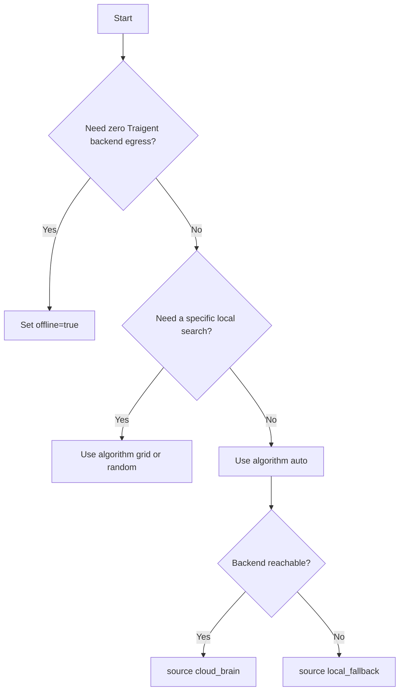

# Choosing the Right Optimization Model

Traigent optimization has two public routing knobs:

- `algorithm`: `"auto"` by default, or explicit `"grid"` / `"random"` /
  cloud-backed smart algorithms.
- `offline`: `False` by default; set `True` for zero Traigent backend egress.

Trials run in your process. The cloud-brain path asks Traigent for optimizer
decisions; it does not execute your dataset examples remotely.

## Quick Decision Guide



Set `TRAIGENT_REQUIRE_CLOUD=1` when fallback is not acceptable.

## Options

| Request | What happens | Result `source` |
| --- | --- | --- |
| `algorithm="auto"` | Cloud optimizer chooses configs; trials run locally | `cloud_brain` |
| `algorithm="auto"` and connectivity failure | Warns and falls back to local search | `local_fallback` |
| `algorithm="grid"` or `"random"` | Runs locally with no cloud optimizer round trip | `explicit_local` |
| `offline=True` or `TRAIGENT_OFFLINE=1` | Fully local, zero Traigent backend egress | `offline` |
| Smart algorithm name | Requires cloud; errors if offline or unavailable | `cloud_brain` |

## Default Cloud-First Auto

```python
@traigent.optimize(
    evaluation={"eval_dataset": "evals.jsonl"},
    configuration_space={"model": ["gpt-4o-mini", "gpt-4o"]},
    objectives=["accuracy"],
)
def agent(question: str) -> str:
    return answer_question(question)

result = agent.optimize(max_trials=8)
print(result.source)
```

Use this when cloud optimizer decisions are acceptable and local fallback is
acceptable during connectivity failures.

## Explicit Local Search

```python
result = agent.optimize(algorithm="grid", max_trials=8)
print(result.source)  # explicit_local
```

Use this for reproducible local sweeps, CI smoke tests, and simple baselines.

## Offline / No Egress

```python
@traigent.optimize(
    evaluation={"eval_dataset": "evals.jsonl"},
    configuration_space={"temperature": [0.0, 0.3, 0.7]},
    objectives=["accuracy"],
    algorithm="grid",
    offline=True,
)
def sensitive_agent(question: str) -> str:
    return answer_question(question)
```

`offline=True` prevents Traigent backend calls. It does not prevent calls your
function makes to LLM providers, databases, or tools.

## Smart Algorithms

Smart algorithms are cloud optimizers:

```python
result = agent.optimize(algorithm="bayesian", max_trials=20)
print(result.source)  # cloud_brain
```

They hard-error when `offline=True` is set or when the backend is unavailable.
Use `algorithm="auto"` if you want cloud-first behavior with local fallback.

## Privacy Boundary

Cloud-brain optimization sends only configuration IDs/schema, trial IDs, numeric
metrics, counts, and statuses. Dataset example content does not cross the
Traigent backend boundary: no example inputs, expected outputs, prompts,
responses, or example metadata.

Privacy-on cloud-brain mode is not the same as no-network mode. Use
`offline=True` or `TRAIGENT_OFFLINE=1` for zero Traigent backend egress.
