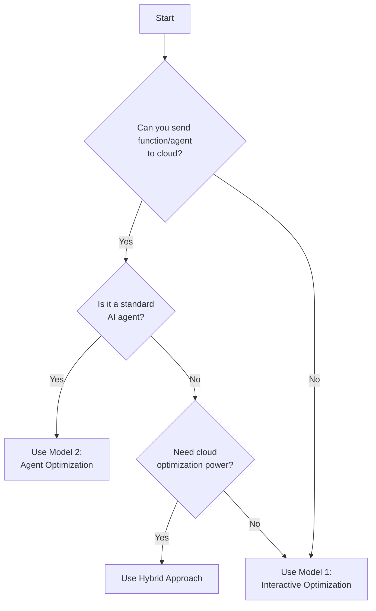

# Choosing the Right Optimization Model

TraiGent SDK offers two distinct optimization models. This guide helps you choose the right approach for your use case.

## Quick Decision Guide



## Model Comparison

### Model 1: Interactive Optimization (Client-Side Execution)

**How it works:**

- Optimization logic runs in the cloud
- Function execution happens locally
- Only configuration suggestions and results are exchanged

**Best for:**

- Custom functions that can't be serialized
- Sensitive data that must stay local
- Low-latency requirements
- Non-standard execution environments

**Example use cases:**

- Optimizing proprietary algorithms
- Healthcare/financial applications with data privacy requirements
- Hardware-in-the-loop optimization
- Real-time systems

### Model 2: Agent Optimization (Cloud-Based Execution)

**How it works:**

- Complete agent specification sent to cloud
- Execution and optimization happen in the cloud
- Results returned after optimization completes

**Best for:**

- Standard AI agents (LangChain, OpenAI, etc.)
- When you want parallel cloud execution
- Complex optimization requiring significant compute
- Multi-objective optimization scenarios

**Example use cases:**

- Chatbot optimization
- Content generation tuning
- Question-answering systems
- Code generation agents

## Detailed Comparison Table

| Aspect                 | Model 1: Interactive       | Model 2: Agent                 | Hybrid Approach       |
| ---------------------- | -------------------------- | ------------------------------ | --------------------- |
| **Execution Location** | Local client               | Cloud service                  | Both                  |
| **Data Privacy**       | ✅ High (data stays local) | ⚠️ Medium (data sent to cloud) | 🔄 Configurable       |
| **Setup Complexity**   | Medium                     | Low                            | High                  |
| **Optimization Speed** | Slower (sequential)        | Faster (parallel)              | Fast with flexibility |
| **Cost**               | Lower (local compute)      | Higher (cloud compute)         | Medium                |
| **Scalability**        | Limited by local resources | High (cloud scale)             | High                  |
| **Real-time Support**  | ✅ Yes                     | ❌ No                          | ✅ Yes (Phase 1)      |
| **Custom Functions**   | ✅ Yes                     | ❌ No                          | ✅ Yes                |
| **Standard AI Agents** | ⚠️ Requires adapter        | ✅ Native support              | ✅ Yes                |
| **Network Dependency** | Low (suggestions only)     | High (full execution)          | Medium                |

## Implementation Examples

### Model 1: Interactive Optimization

```python
from traigent.cloud.client import TraiGentCloudClient
from traigent.optimizers.interactive_optimizer import InteractiveOptimizer

cloud_client = TraiGentCloudClient(api_key="your-api-key")

# For a custom local function
async def my_custom_function(text: str, temperature: float) -> str:
    # Your proprietary logic here
    result = proprietary_algorithm(text, temperature)
    return result

# Setup interactive optimization
optimizer = InteractiveOptimizer(
    config_space={"temperature": (0.0, 1.0)},
    objectives=["quality", "speed"],
    remote_service=cloud_client
)

# Initialize session
session = await optimizer.initialize_session(
    function_name="my_custom_function",
    max_trials=20
)

# Optimization loop
while True:
    suggestion = await optimizer.get_next_suggestion(dataset_size=len(my_dataset))
    if not suggestion:
        break

    # Execute locally with suggested config
    result = await my_custom_function(
        text=example.input,
        temperature=suggestion.config["temperature"]
    )

    # Report results
    await optimizer.report_results(
        trial_id=suggestion.trial_id,
        metrics=evaluate(result),
        duration=execution_time
    )
```

### Model 2: Agent Optimization

```python
from traigent.cloud.client import TraiGentCloudClient
from traigent.cloud.models import AgentSpecification
from traigent.evaluators.base import Dataset, EvaluationExample

cloud_client = TraiGentCloudClient(api_key="your-api-key")

# Define a standard AI agent
agent_spec = AgentSpecification(
    id="qa-agent",
    name="QA Agent",
    agent_type="conversational",
    agent_platform="openai",
    prompt_template="Answer: {question}",
    model_parameters={"model": "o4-mini", "temperature": 0.7},
)

# Create dataset programmatically
dataset = Dataset([
    EvaluationExample(input_data={"question": "What is AI?"}, expected_output="Artificial Intelligence"),
])

# Start cloud optimization
async with cloud_client:
    response = await cloud_client.optimize_agent(
        agent_spec=agent_spec,
        dataset=dataset,
        configuration_space={
            "model": ["o4-mini", "GPT-4o"],
            "temperature": (0.0, 1.0)
        },
        objectives=["accuracy", "cost"],
        max_trials=30
    )

# response includes optimization details and best configuration
```

### Hybrid Approach

Use both models in sequence:
- Phase 1: Run Interactive Optimization locally to narrow the search.
- Phase 2: Use Agent Optimization in the cloud to refine on a larger space.
- Phase 3: Validate the chosen configuration on the full local dataset.

## Decision Factors

### Choose Model 1 When:

1. **Data Sensitivity is Critical**

   - Healthcare records
   - Financial data
   - Proprietary datasets
   - Personal information

2. **Function Characteristics**

   - Uses local resources (GPU, files, hardware)
   - Contains proprietary algorithms
   - Requires specific environment setup
   - Has complex dependencies

3. **Performance Requirements**
   - Need real-time responses
   - Require predictable latency
   - Have limited network bandwidth
   - Need to minimize API costs

### Choose Model 2 When:

1. **Using Standard AI Platforms**

   - OpenAI GPT models
   - LangChain agents
   - Hugging Face models
   - Other cloud-based AI services

2. **Optimization Requirements**

   - Need parallel execution
   - Want sophisticated algorithms
   - Require multi-objective optimization
   - Have large configuration spaces

3. **Resource Availability**
   - Have good network connectivity
   - Can afford cloud compute costs
   - Don't have local compute constraints
   - Want hands-off optimization

### Choose Hybrid When:

1. **Complex Requirements**

   - Need both privacy and power
   - Want phased optimization
   - Require flexible deployment
   - Have mixed sensitivity data

2. **Optimization Strategy**
   - Fast initial exploration locally
   - Cloud refinement for best results
   - Local validation before deployment
   - Cost-sensitive optimization

## Cost Considerations

### Model 1 Costs:

- **Cloud**: Only optimization suggestions (minimal)
- **Local**: Your compute/electricity costs
- **Network**: Minimal data transfer

### Model 2 Costs:

- **Cloud**: Full execution costs (can be significant)
- **Local**: Minimal
- **Network**: Dataset upload costs

### Hybrid Costs:

- **Cloud**: Reduced through intelligent phase management
- **Local**: Moderate during exploration phase
- **Network**: Optimized through subset selection

## Migration Strategies

### From Model 1 to Model 2:

1. Wrap your function as an agent specification
2. Ensure function can be serialized/described
3. Test with small dataset first
4. Gradually move execution to cloud

### From Model 2 to Model 1:

1. Create local executor for your agent
2. Implement evaluation locally
3. Connect to interactive optimizer
4. Test latency and accuracy

## Performance Tips

### Model 1 Performance:

- Use dataset subset suggestions efficiently
- Batch local executions when possible
- Cache results for similar configurations
- Implement parallel local execution

### Model 2 Performance:

- Choose appropriate `parallel_config` settings (e.g., `parallel_config={"trial_concurrency": 4}`)
- Use early stopping to save costs
- Start with smaller datasets
- Enable smart subset selection

## Security Considerations

### Model 1 Security:

- ✅ Data never leaves your environment
- ✅ Full control over execution
- ⚠️ Ensure secure connection for suggestions
- ⚠️ Validate configuration suggestions

### Model 2 Security:

- ⚠️ Review cloud service security policies
- ⚠️ Understand data retention policies
- ✅ Use encryption in transit
- ✅ Implement access controls

## Conclusion

Choose based on your primary constraints:

- **Privacy-first**: Model 1
- **Performance-first**: Model 2
- **Flexibility-first**: Hybrid

Remember that you can start with one model and migrate to another as your requirements evolve. The TraiGent SDK is designed to support this flexibility.
