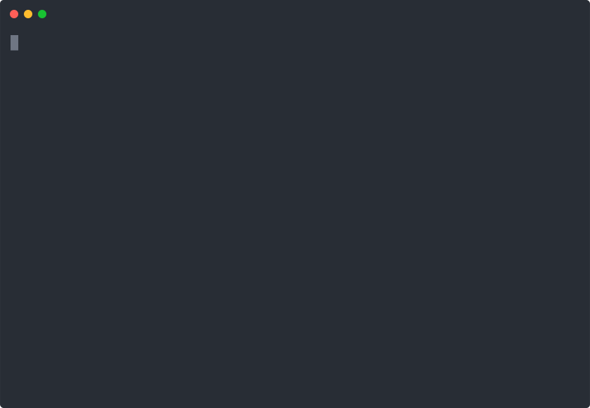

# Knowledge & RAG Agent Use Case

> **RAG you can trust: grounded answers or clean abstain**

<p align="center">
  <a href="demo/demo.cast">
    
  </a>
</p>

This use case demonstrates optimizing a **Retrieval-Augmented Generation (RAG)** agent that answers questions about technical documentation.

## Overview

The RAG agent answers questions about the CloudStack API by:
1. Retrieving relevant documentation chunks
2. Generating answers grounded in the retrieved content
3. Appropriately abstaining when knowledge is insufficient

It optimizes for:
- **Grounded Accuracy** - Answers that are both correct AND faithful to sources
- **Retrieval Quality** - Finding the right documents
- **Abstention Accuracy** - Knowing when NOT to answer

## Quick Start

```bash
# From project root
cd /path/to/Traigent

# Enable mock mode (recommended for testing)
export TRAIGENT_MOCK_MODE=true

# Run the agent optimization
python use-cases/knowledge-rag/agent/rag_agent.py
```

## Configuration Space

| Parameter | Values | Description |
|-----------|--------|-------------|
| `model` | gpt-3.5-turbo, gpt-4o-mini, gpt-4o | LLM model selection |
| `temperature` | 0.0, 0.1, 0.3 | Low for factual accuracy |
| `top_k` | 3, 5, 7, 10 | Number of documents to retrieve |
| `confidence_threshold` | 0.5, 0.7, 0.85 | When to abstain |

## Knowledge Base

The knowledge base (`datasets/knowledge_base/cloudstack_docs.json`) contains ~40 documentation chunks covering:

- Authentication (API keys, OAuth2, scopes)
- Rate Limits (tiers, headers, bursting)
- Endpoints (resources, instances, storage, networks)
- Errors (codes, handling, best practices)
- Best Practices (pagination, idempotency, webhooks, SDKs)
- Pricing (tiers, usage-based billing)
- Security (certifications, encryption, compliance)
- And more...

## Dataset

The evaluation dataset (`datasets/qa_dataset.jsonl`) contains 203 questions:
- Answerable questions with gold-standard answers and source references
- Unanswerable questions to test abstention behavior

### Sample Entry

```json
{
  "input": {
    "question": "What is the rate limit for the CloudStack API?"
  },
  "output": "The rate limit depends on your tier: Standard tier has 100 requests per minute...",
  "source_ids": ["doc_rate_01"],
  "answerable": true
}
```

### Unanswerable Question Example

```json
{
  "input": {
    "question": "Does CloudStack support GraphQL?"
  },
  "output": "I don't have information about GraphQL support in the CloudStack documentation.",
  "source_ids": [],
  "answerable": false
}
```

## Evaluation Metrics

### Grounded Accuracy

Combines correctness and faithfulness:
- **Correctness**: Semantic similarity to expected answer
- **Faithfulness**: Answer is supported by cited sources

### Retrieval Quality

- Precision/Recall of retrieved documents vs expected sources
- Retrieval success rate (at least one relevant doc in top-k)

### Abstention Accuracy

Binary classification metrics:
- Correct abstention when answer is not in knowledge base
- Penalizes "false confidence" (answering when should abstain)
- Mild penalty for "false humility" (abstaining when could answer)

## Files

```
knowledge-rag/
├── agent/
│   └── rag_agent.py                    # Main RAG agent
├── datasets/
│   ├── knowledge_base/
│   │   └── cloudstack_docs.json        # 40+ doc chunks
│   └── qa_dataset.jsonl                # 203 Q&A pairs
├── eval/
│   └── evaluator.py                    # RAG evaluator
└── README.md
```

## Expected Results

After optimization, you should see results like:

```
Best Configuration:
  model: gpt-4o-mini
  temperature: 0.1
  top_k: 5
  confidence_threshold: 0.7

Best Score: 0.82
```

## Key Concepts

### Abstention Behavior

The agent should abstain when:
- The question is about topics not in the knowledge base
- The retrieved documents don't contain relevant information
- Confidence is below the threshold

Abstention phrases detected:
- "I don't have information"
- "not in the documentation"
- "cannot find"
- "unable to answer"

### Grounding

Answers must be:
1. **Correct** - Matches the expected answer semantically
2. **Grounded** - Only uses information from retrieved documents
3. **Cited** - References the source documents

## Customization

### Adding Knowledge Base Content

Edit `datasets/knowledge_base/cloudstack_docs.json` to add more documentation chunks:

```json
{
  "id": "doc_new_feature_01",
  "title": "New Feature",
  "section": "Features",
  "content": "Description of the new feature..."
}
```

### Adding Test Questions

Add entries to `datasets/qa_dataset.jsonl`:

```json
{"input": {"question": "Your question?"}, "output": "Expected answer", "source_ids": ["doc_id"], "answerable": true}
```

### Testing the Evaluator

```bash
python use-cases/knowledge-rag/eval/evaluator.py
```

## Two Critical Failure Modes

From the Traigent Guide:

1. **"Correct but ungrounded"** - Answer is true but not supported by retrieved documents (model using parametric knowledge)

2. **"Grounded but wrong"** - Answer accurately summarizes retrieved docs, but those docs are incorrect or outdated

Both erode user trust differently and are measured separately.
